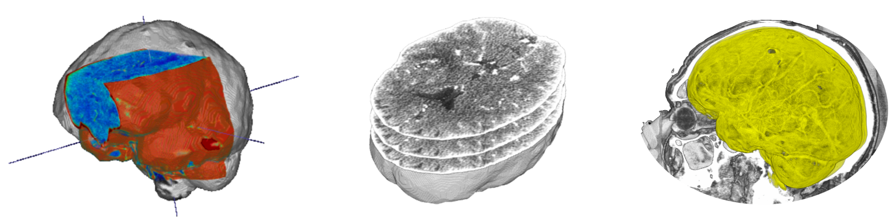

<div align="center">

  <!-- headline -->
  <center><h1> NIfTI Dataset Management</h1></center>

  <!-- PyPI badge -->
  <a href="https://pypi.org/project/nidataset/">
    
  </a>

</div>

<br>

This package provides a set of utilities for handling NIfTI datasets, including slice extraction, volume manipulation, and various utility functions to facilitate the processing of medical imaging data. <br>



<br>

## ⬇️ Installation and Import
Now, this code is available with PyPI at https://pypi.org/project/nidataset/. The package can be installed with:

```bash
pip install nidataset
```

and can be imported as:

```python
import nidataset as nid
```

## 📂 Project Organization

The package consists of the following Python modules:
```bash
.
├── nidataset/                # The NIfTI dataset management package folder
│   ├── Draw.py               # Functions for drawing and manipulating bounding boxes on NIfTI images.
│   ├── Preprocessing.py      # Functions for preprocessing pipelines on NIfTI images.
│   ├── Slices.py             # Functions for extracting slices and annotations from NIfTI files.
│   ├── Utility.py            # Utility functions for dataset information statistics.
│   └── Volume.py             # Functions for NIfTI volume transformations and modifications.
│
├── example.py                # The script that demonstrates usage of the package.
│
├── dataset/                  # Example dataset folder
│   ├── toy-CTA.nii.gz        # Example NIfTI file.
│   └── toy-annotation.nii.gz # Example annotation file.
│
└── output/                   # Folder for output results
```

Run the application example with:

```bash
python3 example.py
```

This code will extract the slices and the annotations from a toy CTA and annotation bounding box. Then axial and coronal views are shifted.

## 📦 Package documentation

### `draw_boxes`

Draw 3‑D bounding boxes on a reference **NIfTI** volume and save the result as `<filename>_boxes.nii.gz`.

```python
draw_boxes(
    df: pd.DataFrame,
    nii_path: str,
    output_path: str,
    intensity_based_on_score: bool = False,
    debug: bool = False
) -> None
```

#### Parameters

| Name                       | Type           | Description                                                                                                                                                     |
| -------------------------- | -------------- | --------------------------------------------------------------------------------------------------------------------------------------------------------------- |
| `df`                       | `pd.DataFrame` | Bounding‑box coordinates. Must contain:<br>• `'X MIN', 'Y MIN', 'Z MIN', 'X MAX', 'Y MAX', 'Z MAX'`<br>• Optional `'SCORE'` if `intensity_based_on_score=True`. |
| `nii_path`                 | `str`          | Path to the reference `.nii.gz` file used for shape and affine.                                                                                                 |
| `output_path`              | `str`          | Directory in which to write the new file (created automatically if missing).                                                                                    |
| `intensity_based_on_score` | `bool`         | **False** → every box voxel = `1`.<br>**True** → voxel intensity tiers: `≤0.50 → 1`, `≤0.75 → 2`, `>0.75 → 3`.                                                  |
| `debug`                    | `bool`         | If **True**, prints the final file path.                                                                                                                        |

#### Returns

`None` – writes the new NIfTI file to disk.

#### Example

```python
import pandas as pd
from nidataset.draw import draw_boxes

boxes = pd.DataFrame({
    "SCORE": [0.30, 0.80],
    "X MIN": [10, 40], "Y MIN": [12, 42], "Z MIN": [14, 44],
    "X MAX": [20, 50], "Y MAX": [22, 52], "Z MAX": [24, 54]
})

draw_boxes(
    df=boxes,
    nii_path="brain.nii.gz",
    output_path="results/",
    intensity_based_on_score=True
)
```

---

### `from_2D_to_3D_coords`

Convert 2‑D slice‑based coordinates to canonical **(X, Y, Z)** order for axial, coronal, or sagittal views.

```python
from_2D_to_3D_coords(
    df: pd.DataFrame,
    view: str
) -> pd.DataFrame
```

#### Parameters

| Name   | Type           | Description                                                                                                                                                           |
| ------ | -------------- | --------------------------------------------------------------------------------------------------------------------------------------------------------------------- |
| `df`   | `pd.DataFrame` | Accepted layouts:<br>• **3‑column** – `['X', 'Y', 'SLICE NUMBER']`<br>• **6‑column** – `['X MIN', 'Y MIN', 'SLICE NUMBER MIN', 'X MAX', 'Y MAX', 'SLICE NUMBER MAX']` |
| `view` | `str`          | One of `'axial'`, `'coronal'`, `'sagittal'`.                                                                                                                          |

#### Returns

`pd.DataFrame` – Copy of `df` with columns renamed to `['X', 'Y', 'Z']` **or** `['X MIN', 'Y MIN', 'Z MIN', 'X MAX', 'Y MAX', 'Z MAX']`, reordered so that **Z** is the slice index.

#### Example

```python
import pandas as pd
from nidataset.draw import from_2D_to_3D_coords

axial_boxes = pd.DataFrame({
    "X MIN": [10], "Y MIN": [15], "SLICE NUMBER MIN": [5],
    "X MAX": [20], "Y MAX": [25], "SLICE NUMBER MAX": [10]
})

boxes_3d = from_2D_to_3D_coords(axial_boxes, view="axial")

print(boxes_3d.head())
```

---

### `skull_CTA`

Apply a CTA‑oriented skull‑stripping pipeline (threshold → smoothing → FSL BET → clipping) to a single **NIfTI** file. The result is written as `<filename>.skulled.clipped.nii.gz` plus a corresponding mask.

```python
skull_CTA(
    nii_path: str,
    output_path: str,
    f_value: float = 0.1,
    clip_value: tuple = (0, 200),
    cleanup: bool = False,
    debug: bool = False
) -> None
```

#### Parameters

| Name          | Type    | Description                                                                      |
| ------------- | ------- | -------------------------------------------------------------------------------- |
| `nii_path`    | `str`   | Path to the input `.nii.gz` CTA volume.                                          |
| `output_path` | `str`   | Folder for intermediate and final outputs (created if missing).                  |
| `f_value`     | `float` | Fractional intensity threshold for **BET**.                                      |
| `clip_value`  | `tuple` | Intensity range `(min, max)` used to clamp brain voxels after skull‑stripping.   |
| `cleanup`     | `bool`  | If **True**, deletes intermediate images, retaining only mask and clipped brain. |
| `debug`       | `bool`  | If **True**, prints file paths when done.                                        |

#### Returns

`None` – writes the stripped image (`.skulled.clipped.nii.gz`) and its mask to `output_path`.

#### Example

```python
from nidataset.preprocessing import skull_CTA

skull_CTA(
    nii_path="cta_case01.nii.gz",
    output_path="results/case01/",
    f_value=0.15,
    clip_value=(0, 150),
    cleanup=True,
    debug=True
)
```

---

### `skull_CTA_dataset`

Run the same skull‑stripping pipeline over every `.nii.gz` file in a folder, with optional per‑case or shared output layout.

```python
skull_CTA_dataset(
    nii_folder: str,
    output_path: str,
    f_value: float = 0.1,
    clip_value: tuple = (0, 200),
    cleanup: bool = False,
    saving_mode: str = "case",
    debug: bool = False
) -> None
```

#### Parameters

| Name          | Type    | Description                                                             |
| ------------- | ------- | ----------------------------------------------------------------------- |
| `nii_folder`  | `str`   | Folder containing input `.nii.gz` files.                                |
| `output_path` | `str`   | Destination for processed outputs.                                      |
| `f_value`     | `float` | BET fractional threshold passed to each call.                           |
| `clip_value`  | `tuple` | Intensity range `(min, max)` for voxel clipping.                        |
| `cleanup`     | `bool`  | Remove intermediates after each case.                                   |
| `saving_mode` | `str`   | `'case'` → sub‑folder per file; `'folder'` → all results in one folder. |
| `debug`       | `bool`  | Verbose progress messages.                                              |

#### Returns

`None` – processes every file in `nii_folder` and saves outputs under `output_path`.

#### Example

```python
from nidataset.preprocessing import skull_CTA_dataset

skull_CTA_dataset(
    nii_folder="dataset/cta/",
    output_path="results/skull_strip/",
    f_value=0.1,
    clip_value=(0, 200),
    cleanup=False,
    saving_mode="case",
    debug=True
)
```

---

### `mip`

Generate a sliding‑window 3‑D Maximum Intensity Projection (MIP) from a single volume and save it as `<filename>_mip_<view>.nii.gz`.

```python
mip(
    nii_path: str,
    output_path: str,
    window_size: int = 10,
    view: str = "axial",
    debug: bool = False
) -> None
```

#### Parameters

| Name          | Type   | Description                                                      |
| ------------- | ------ | ---------------------------------------------------------------- |
| `nii_path`    | `str`  | Input `.nii.gz` volume.                                          |
| `output_path` | `str`  | Destination folder (created if needed).                          |
| `window_size` | `int`  | Number of neighbouring slices merged for each projection.        |
| `view`        | `str`  | `'axial'` → Z‑axis, `'coronal'` → Y‑axis, `'sagittal'` → X‑axis. |
| `debug`       | `bool` | Print saved file path when **True**.                             |

#### Returns

`None` – writes the MIP NIfTI to `output_path`.

#### Example

```python
from nidataset.preprocessing import mip

mip(
    nii_path="cta_case01.nii.gz",
    output_path="results/mip/",
    window_size=20,
    view="coronal",
    debug=True
)
```

---

### `mip_dataset`

Create MIP volumes for every NIfTI file in a folder, optionally grouping outputs by case or by view.

```python
mip_dataset(
    nii_folder: str,
    output_path: str,
    window_size: int = 10,
    view: str = "axial",
    saving_mode: str = "case",
    debug: bool = False
) -> None
```

#### Parameters

| Name          | Type   | Description                                                     |
| ------------- | ------ | --------------------------------------------------------------- |
| `nii_folder`  | `str`  | Directory with `.nii.gz` files.                                 |
| `output_path` | `str`  | Destination root for MIP outputs.                               |
| `window_size` | `int`  | Window width used for each MIP.                                 |
| `view`        | `str`  | `'axial'`, `'coronal'`, or `'sagittal'`.                        |
| `saving_mode` | `str`  | `'case'` → sub‑folder per file; `'view'` → one folder per view. |
| `debug`       | `bool` | Verbose logging.                                                |

#### Returns

`None` – generates MIPs for all cases in `nii_folder`.

#### Example

```python
from nidataset.preprocessing import mip_dataset

mip_dataset(
    nii_folder="dataset/cta/",
    output_path="results/mip/",
    window_size=15,
    view="axial",
    saving_mode="view",
    debug=False
)
```

---

### `resampling`

Resample a volume to a specified voxel grid and save as `<filename>_resampled.nii.gz`.

```python
resampling(
    nii_path: str,
    output_path: str,
    desired_volume: tuple,
    debug: bool = False
) -> None
```

#### Parameters

| Name             | Type    | Description                                                     |
| ---------------- | ------- | --------------------------------------------------------------- |
| `nii_path`       | `str`   | Input `.nii.gz` volume.                                         |
| `output_path`    | `str`   | Folder in which to save the resampled file (created if absent). |
| `desired_volume` | `tuple` | Target size `(X, Y, Z)` in voxels.                              |
| `debug`          | `bool`  | Print the output path when **True**.                            |

#### Returns

`None` – writes the resampled image to `output_path`.

#### Example

```python
from nidataset.preprocessing import resampling

resampling(
    nii_path="cta_case01.nii.gz",
    output_path="results/resampled/",
    desired_volume=(224, 224, 128),
    debug=True
)
```

---

### `resampling_dataset`

Apply `resampling` to every `.nii.gz` file in a folder with optional per‑case or shared outputs.

```python
resampling_dataset(
    nii_folder: str,
    output_path: str,
    desired_volume: tuple,
    saving_mode: str = "case",
    debug: bool = False
) -> None
```

#### Parameters

| Name             | Type    | Description                                                  |
| ---------------- | ------- | ------------------------------------------------------------ |
| `nii_folder`     | `str`   | Folder containing input volumes.                             |
| `output_path`    | `str`   | Destination root.                                            |
| `desired_volume` | `tuple` | Target size `(X, Y, Z)` for every case.                      |
| `saving_mode`    | `str`   | `'case'` → sub‑folder per file; `'folder'` → all in one dir. |
| `debug`          | `bool`  | Verbose logging.                                             |

#### Returns

`None` – resamples all files in `nii_folder`.

#### Example

```python
from nidataset.preprocessing import resampling_dataset

resampling_dataset(
    nii_folder="dataset/cta/",
    output_path="results/resampled/",
    desired_volume=(224, 224, 128),
    saving_mode="folder",
    debug=False
)
```

---

### `register_CTA`

Register a CTA image to a template using mutual‑information optimisation. Produces a registered volume, a Gaussian‑filtered intermediate, and a transformation `.tfm`.

```python
register_CTA(
    nii_path: str,
    mask_path: str,
    template_path: str,
    template_mask_path: str,
    output_image_path: str,
    output_transformation_path: str,
    cleanup: bool = False,
    debug: bool = False
) -> None
```

#### Parameters

| Name                         | Type   | Description                                            |
| ---------------------------- | ------ | ------------------------------------------------------ |
| `nii_path`                   | `str`  | Input CTA volume.                                      |
| `mask_path`                  | `str`  | Corresponding brain mask.                              |
| `template_path`              | `str`  | Reference template image.                              |
| `template_mask_path`         | `str`  | Template mask.                                         |
| `output_image_path`          | `str`  | Folder for registered image and filtered intermediate. |
| `output_transformation_path` | `str`  | Folder for `.tfm` transform.                           |
| `cleanup`                    | `bool` | Delete Gaussian intermediate after success.            |
| `debug`                      | `bool` | Print saved paths when **True**.                       |

#### Returns

`None` – saves `_registered.nii.gz`, `_gaussian_filtered.nii.gz`, and `_transformation.tfm` under the specified output paths.

#### Example

```python
from nidataset.preprocessing import register_CTA

register_CTA(
    nii_path="cta_case01.nii.gz",
    mask_path="cta_case01_mask.nii.gz",
    template_path="template.nii.gz",
    template_mask_path="template_mask.nii.gz",
    output_image_path="results/registered/images/",
    output_transformation_path="results/registered/transforms/",
    cleanup=True,
    debug=False
)
```

---

### `register_CTA_dataset`

Batch‑register every CTA volume in a folder to a template, with optional per‑case output grouping.

```python
register_CTA_dataset(
    nii_folder: str,
    mask_folder: str,
    template_path: str,
    template_mask_path: str,
    output_image_path: str,
    output_transformation_path: str = "",
    saving_mode: str = "case",
    cleanup: bool = False,
    debug: bool = False
) -> None
```

#### Parameters

| Name                         | Type   | Description                                                                                         |
| ---------------------------- | ------ | --------------------------------------------------------------------------------------------------- |
| `nii_folder`                 | `str`  | Folder with input CTA volumes.                                                                      |
| `mask_folder`                | `str`  | Folder with corresponding brain masks.                                                              |
| `template_path`              | `str`  | Registration template image.                                                                        |
| `template_mask_path`         | `str`  | Template mask.                                                                                      |
| `output_image_path`          | `str`  | Destination for registered images.                                                                  |
| `output_transformation_path` | `str`  | Destination for `.tfm` files (ignored when `saving_mode='case'` as they are stored with the image). |
| `saving_mode`                | `str`  | `'case'` → sub‑folder per volume; `'folder'` → all results in shared dirs.                          |
| `cleanup`                    | `bool` | Remove Gaussian intermediates after each case.                                                      |
| `debug`                      | `bool` | Verbose progress output.                                                                            |

#### Returns

`None` – registers all volumes in `nii_folder`.

#### Example

```python
from nidataset.preprocessing import register_CTA_dataset

register_CTA_dataset(
    nii_folder="dataset/cta/",
    mask_folder="dataset/masks/",
    template_path="template.nii.gz",
    template_mask_path="template_mask.nii.gz",
    output_image_path="results/registered/images/",
    output_transformation_path="results/registered/transforms/",
    saving_mode="folder",
    cleanup=False,
    debug=False
)
```

---

### `extract_slices`

Extract all slices from a 3‑D **NIfTI** volume and save them as `.tif` images using the pattern

```
<filename>_<view>_<slice‑idx>.tif
```

```python
extract_slices(
    nii_path: str,
    output_path: str,
    view: str = "axial",
    debug: bool = False
) -> None
```

#### Parameters

| Name          | Type   | Description                                                      |
| ------------- | ------ | ---------------------------------------------------------------- |
| `nii_path`    | `str`  | Input `.nii.gz` volume.                                          |
| `output_path` | `str`  | Folder for the extracted images (created if absent).             |
| `view`        | `str`  | `'axial'` → Z‑axis, `'coronal'` → Y‑axis, `'sagittal'` → X‑axis. |
| `debug`       | `bool` | Print total number of slices when **True**.                      |

#### Returns

`None` – writes one `.tif` per slice to `output_path`.

#### Example

```python
from nidataset.slices import extract_slices

extract_slices(
    nii_path="brain.nii.gz",
    output_path="results/slices/",
    view="sagittal",
    debug=True
)
```

---

### `extract_slices_dataset`

Batch‑extract slices from every `.nii.gz` file in a folder, with optional per‑case or shared output layout and optional per‑case slice statistics.

```python
extract_slices_dataset(
    nii_folder: str,
    output_path: str,
    view: str = "axial",
    saving_mode: str = "case",
    save_stats: bool = False
) -> None
```

#### Parameters

| Name          | Type   | Description                                                                         |
| ------------- | ------ | ----------------------------------------------------------------------------------- |
| `nii_folder`  | `str`  | Folder with input volumes.                                                          |
| `output_path` | `str`  | Destination root for extracted images.                                              |
| `view`        | `str`  | `'axial'`, `'coronal'`, or `'sagittal'`.                                            |
| `saving_mode` | `str`  | `'case'` → sub‑folder per file; `'view'` → one folder per view.                     |
| `save_stats`  | `bool` | If **True**, writes `<view>_slices_stats.csv` containing counts per case and total. |

#### Returns

`None` – saves all slices and optional statistics file under `output_path`.

#### Example

```python
from nidataset.slices import extract_slices_dataset

extract_slices_dataset(
    nii_folder="dataset/",
    output_path="results/slices/",
    view="coronal",
    saving_mode="view",
    save_stats=True
)
```

---

### `extract_annotations`

Export bounding‑box annotations from a 3‑D label map into CSV files. Supports per‑slice or per‑volume output and either box centers or full coordinates.

```python
extract_annotations(
    nii_path: str,
    output_path: str,
    view: str = "axial",
    saving_mode: str = "slice",
    data_mode: str = "center",
    debug: bool = False
) -> None
```

#### Parameters

| Name          | Type   | Description                                                                                   |
| ------------- | ------ | --------------------------------------------------------------------------------------------- |
| `nii_path`    | `str`  | Input annotation volume (`.nii.gz`).                                                          |
| `output_path` | `str`  | Folder for CSV outputs (created if needed).                                                   |
| `view`        | `str`  | Alignment for 2‑D extraction: `'axial'`, `'coronal'`, `'sagittal'`.                           |
| `saving_mode` | `str`  | `'slice'` → one CSV per slice; `'volume'` → single CSV for entire scan.                       |
| `data_mode`   | `str`  | `'center'` → save `(x, y, z)` centers; `'box'` → save `(xmin, ymin, zmin, xmax, ymax, zmax)`. |
| `debug`       | `bool` | Print counts when **True**.                                                                   |

#### Returns

`None` – writes CSV files named either

```
<filename>_<view>_<slice‑idx>.csv  # when saving_mode='slice'
<filename>.csv                    # when saving_mode='volume'
```

#### Example

```python
from nidataset.slices import extract_annotations

extract_annotations(
    nii_path="brain_labels.nii.gz",
    output_path="results/annots/",
    view="sagittal",
    saving_mode="volume",
    data_mode="box",
    debug=True
)
```

---

### `extract_annotations_dataset`

Run `extract_annotations` over an entire dataset folder with optional per‑case or shared output, per‑slice or per‑volume extraction, and optional annotation statistics.

```python
extract_annotations_dataset(
    nii_folder: str,
    output_path: str,
    view: str = "axial",
    saving_mode: str = "case",
    extraction_mode: str = "slice",
    data_mode: str = "center",
    save_stats: bool = False
) -> None
```

#### Parameters

| Name              | Type   | Description                                                                        |
| ----------------- | ------ | ---------------------------------------------------------------------------------- |
| `nii_folder`      | `str`  | Directory with annotation volumes.                                                 |
| `output_path`     | `str`  | Destination root.                                                                  |
| `view`            | `str`  | `'axial'`, `'coronal'`, or `'sagittal'`.                                           |
| `saving_mode`     | `str`  | `'case'` → sub‑folder per file; `'view'` → one folder per view.                    |
| `extraction_mode` | `str`  | `'slice'` → CSV per slice; `'volume'` → single CSV per case.                       |
| `data_mode`       | `str`  | `'center'` or `'box'` (see above).                                                 |
| `save_stats`      | `bool` | If **True**, writes `<view>_annotations_stats.csv` with per‑case counts and total. |

#### Returns

`None` – extracts annotations for all cases and writes optional stats file.

#### Example

```python
from nidataset.slices import extract_annotations_dataset

extract_annotations_dataset(
    nii_folder="dataset/labels/",
    output_path="results/annots/",
    view="coronal",
    saving_mode="view",
    extraction_mode="volume",
    data_mode="center",
    save_stats=True
)
```

---

### `dataset_images_info`

Collect metadata for every **NIfTI** file in a folder and save the summary as `dataset_images_info.csv`.

```python
dataset_images_info(
    nii_folder: str,
    output_path: str
) -> None
```

#### Parameters

| Name          | Type  | Description                                               |
| ------------- | ----- | --------------------------------------------------------- |
| `nii_folder`  | `str` | Directory containing input `.nii.gz` volumes.             |
| `output_path` | `str` | Folder where the CSV will be written (created if absent). |

#### Returns

`None` – writes a CSV with one row per file and columns:
`FILENAME, SHAPE (X, Y, Z), VOXEL SIZE (mm), DATA TYPE, MIN VALUE, MAX VALUE, BRAIN VOXELS, BRAIN VOLUME (mm³), BBOX MIN (X, Y, Z), BBOX MAX (X, Y, Z)`.

#### Example

```python
from nidataset.utility import dataset_images_info

dataset_images_info(
    nii_folder="dataset/",
    output_path="results/info/"
)
```

---

### `dataset_annotations_info`

Extract 3‑D bounding boxes of a specific label value from every annotation map in a folder and save them as `dataset_annotations_info.csv`.

```python
dataset_annotations_info(
    nii_folder: str,
    output_path: str,
    annotation_value: int = 1
) -> None
```

#### Parameters

| Name               | Type  | Description                                                    |
| ------------------ | ----- | -------------------------------------------------------------- |
| `nii_folder`       | `str` | Directory with annotation volumes (`.nii.gz`).                 |
| `output_path`      | `str` | Folder where the CSV will be stored (created if needed).       |
| `annotation_value` | `int` | Pixel value representing the region of interest (default `1`). |

#### Returns

`None` – writes a CSV listing each file and its list of bounding boxes (`[xmin, ymin, zmin, xmax, ymax, zmax]`).

#### Example

```python
from nidataset.utility import dataset_annotations_info

dataset_annotations_info(
    nii_folder="dataset/labels/",
    output_path="results/bboxes/",
    annotation_value=1
)
```

---

### `swap_nifti_views`

Re‑orient a 3‑D **NIfTI** volume from one anatomical view to another by permuting axes, rotating 90 °, and updating the affine. The result is saved as `<filename>_swapped_<source>_to_<target>.nii.gz`.

```python
swap_nifti_views(
    nii_path: str,
    output_path: str,
    source_view: str,
    target_view: str,
    debug: bool = False
) -> None
```

#### Parameters

| Name          | Type   | Description                                  |
| ------------- | ------ | -------------------------------------------- |
| `nii_path`    | `str`  | Input `.nii.gz` file.                        |
| `output_path` | `str`  | Destination folder (auto‑created).           |
| `source_view` | `str`  | One of `'axial'`, `'coronal'`, `'sagittal'`. |
| `target_view` | `str`  | Desired orientation — same choices as above. |
| `debug`       | `bool` | Print shapes and path when **True**.         |

#### Returns

`None` – writes the re‑oriented volume to `output_path`.

#### Example

```python
from nidataset.volume import swap_nifti_views

swap_nifti_views(
    nii_path="scan_axial.nii.gz",
    output_path="results/oriented/",
    source_view="axial",
    target_view="sagittal",
    debug=True
)
```

---

### `extract_bounding_boxes`

Detect connected components in a segmentation mask, keep those above a volume threshold, and write a binary mask containing the 3‑D bounding boxes as `<filename>_bounding_boxes.nii.gz`.

```python
extract_bounding_boxes(
    mask_path: str,
    output_path: str,
    voxel_size: tuple = (3.0, 3.0, 3.0),
    volume_threshold: float = 1000.0,
    mask_value: int = 1,
    debug: bool = False
) -> None
```

#### Parameters

| Name               | Type    | Description                            |
| ------------------ | ------- | -------------------------------------- |
| `mask_path`        | `str`   | Input label map (`.nii.gz`).           |
| `output_path`      | `str`   | Folder for the bounding‑box mask.      |
| `voxel_size`       | `tuple` | Physical voxel size `(x, y, z)` mm.    |
| `volume_threshold` | `float` | Minimum component size in mm³ to keep. |
| `mask_value`       | `int`   | Label value to analyse.                |
| `debug`            | `bool`  | Print box count when **True**.         |

#### Returns

`None` – saves the bounding‑box mask to `output_path`.

#### Example

```python
from nidataset.volume import extract_bounding_boxes

extract_bounding_boxes(
    mask_path="lesion_mask.nii.gz",
    output_path="results/bboxes/",
    voxel_size=(0.5, 0.5, 0.5),
    volume_threshold=500.0
)
```

---

### `extract_bounding_boxes_dataset`

Run `extract_bounding_boxes` on every mask in a folder and optionally record counts in `bounding_boxes_stats.csv`.

```python
extract_bounding_boxes_dataset(
    mask_folder: str,
    output_path: str,
    voxel_size: tuple = (3.0, 3.0, 3.0),
    volume_threshold: float = 1000.0,
    mask_value: int = 1,
    save_stats: bool = True,
    debug: bool = False
) -> None
```

#### Parameters

| Name               | Type    | Description                                        |
| ------------------ | ------- | -------------------------------------------------- |
| `mask_folder`      | `str`   | Directory containing `.nii.gz` masks.              |
| `output_path`      | `str`   | Destination for bounding‑box masks and stats file. |
| `voxel_size`       | `tuple` | Voxel spacing in mm.                               |
| `volume_threshold` | `float` | Component size cutoff.                             |
| `mask_value`       | `int`   | Label to analyse.                                  |
| `save_stats`       | `bool`  | Write per‑file counts when **True**.               |
| `debug`            | `bool`  | Verbose output.                                    |

#### Returns

`None` – writes masks and optional stats CSV.

#### Example

```python
from nidataset.volume import extract_bounding_boxes_dataset

extract_bounding_boxes_dataset(
    mask_folder="dataset/masks/",
    output_path="results/bboxes/",
    voxel_size=(1,1,1),
    volume_threshold=200.0,
    save_stats=True
)
```

---

### `generate_brain_mask`

Create a rough brain mask from a CTA scan using intensity thresholding, hole filling, closing, and largest‑component selection. Saves `<filename>_brain_mask.nii.gz`.

```python
generate_brain_mask(
    nii_path: str,
    output_path: str,
    threshold: tuple | None = None,
    closing_radius: int = 3,
    debug: bool = False
) -> None
```

#### Parameters

| Name             | Type            | Description                                                               |
| ---------------- | --------------- | ------------------------------------------------------------------------- |
| `nii_path`       | `str`           | Input CTA (`.nii.gz`).                                                    |
| `output_path`    | `str`           | Folder for the mask.                                                      |
| `threshold`      | `tuple` or `None` | `(low, high)` intensity range; if `None`, an adaptive Otsu range is used. |
| `closing_radius` | `int`           | Radius (voxels) for morphological closing.                                |
| `debug`          | `bool`          | Print threshold and path when **True**.                                   |

#### Returns

`None` – writes the mask to `output_path`.

#### Example

```python
from nidataset.volume import generate_brain_mask

generate_brain_mask(
    nii_path="cta_case01.nii.gz",
    output_path="results/masks/",
    threshold=None,
    closing_radius=5,
    debug=True
)
```

---

### `generate_brain_mask_dataset`

Produce brain masks for every CTA scan in a directory.

```python
generate_brain_mask_dataset(
    nii_folder: str,
    output_path: str,
    threshold: tuple | None = None,
    closing_radius: int = 3,
    debug: bool = False
) -> None
```

#### Parameters

| Name             | Type            | Description                                |
| ---------------- | --------------- | ------------------------------------------ |
| `nii_folder`     | `str`           | Directory with CTA volumes.                |
| `output_path`    | `str`           | Destination for masks.                     |
| `threshold`      | `tuple` or `None` | Manual or automatic threshold (see above). |
| `closing_radius` | `int`           | Closing radius.                            |
| `debug`          | `bool`          | Verbose logging.                           |

#### Returns

`None` – saves one mask per input file.

#### Example

```python
from nidataset.volume import generate_brain_mask_dataset

generate_brain_mask_dataset(
    nii_folder="dataset/cta/",
    output_path="results/masks/",
    threshold=(50, 300),
    closing_radius=4
)
```

---

### `crop_and_pad`

Crop a volume to its non‑zero bounding box, then symmetrically pad or further crop it to a fixed shape while preserving affine alignment. Saves `<filename>_cropped_padded.nii.gz`.

```python
crop_and_pad(
    nii_path: str,
    output_path: str,
    target_shape: tuple = (128, 128, 128),
    debug: bool = False
) -> None
```

#### Parameters

| Name           | Type    | Description                           |
| -------------- | ------- | ------------------------------------- |
| `nii_path`     | `str`   | Input volume.                         |
| `output_path`  | `str`   | Destination folder.                   |
| `target_shape` | `tuple` | Desired `(X, Y, Z)` after processing. |
| `debug`        | `bool`  | Print shapes when **True**.           |

#### Returns

`None` – writes the processed volume to `output_path`.

#### Example

```python
from nidataset.volume import crop_and_pad

crop_and_pad(
    nii_path="cta_case01.nii.gz",
    output_path="results/cropped/",
    target_shape=(160, 160, 96)
)
```

---

### `crop_and_pad_dataset`

Apply `crop_and_pad` to every file in a folder and optionally record original/final shapes in `crop_pad_stats.csv`.

```python
crop_and_pad_dataset(
    nii_folder: str,
    output_path: str,
    target_shape: tuple = (128, 128, 128),
    save_stats: bool = False
) -> None
```

#### Parameters

| Name           | Type    | Description                                |
| -------------- | ------- | ------------------------------------------ |
| `nii_folder`   | `str`   | Directory with CTA volumes.                |
| `output_path`  | `str`   | Destination for processed files and stats. |
| `target_shape` | `tuple` | Desired shape after processing.            |
| `save_stats`   | `bool`  | Write per‑file shape log when **True**.    |

#### Returns

`None` – processes all scans and optional stats CSV.

#### Example

```python
from nidataset.volume import crop_and_pad_dataset

crop_and_pad_dataset(
    nii_folder="dataset/cta/",
    output_path="results/cropped/",
    target_shape=(128,128,128),
    save_stats=True
)
```

## 🚨 Requirements

```bash
Python>=3.8.0
Pillow>=9.4.0
nibabel>=5.1.0
numpy>=1.24.2
scikit-image>=0.19.3
pandas>=1.5.3
SimpleITK>=2.2.1
scipy>=1.10.0
tqdm>=4.67.1
```

Install the requirements with:
```bash
pip install -r requirements.txt
```

## 🤝 Contribution
👨‍💻 [Ciro Russo, PhD](https://www.linkedin.com/in/ciro-russo-b14056100/)

## ⚖️ License

MIT License

