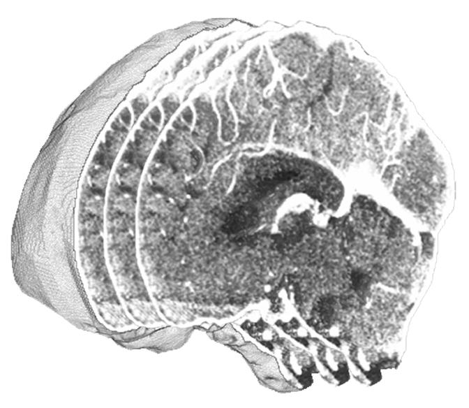

<table>
  <tr>
    <td></td>
    <td><h1>NIfTI Dataset Management</h1></td>
  </tr>
</table>

<br>

This package provides a set of utilities for handling NIfTI datasets, including slice extraction, volume manipulation, and various utility functions to facilitate the processing of medical imaging data.

## ⬇️ Installation
Now, this code is available with PyPI at https://pypi.org/project/nidataset/. The package can be installed with:

```bash
pip install nidataset
```

## 📥 Import
Import the package as:

```python
import nidataset as nid
```

## 📂 Project Organization

The package consists of the following Python modules:
```bash
.
├── nidataset/                # The NIfTI dataset management package folder
│   ├── Slices.py             # Functions for extracting slices and annotations from NIfTI files.
│   ├── Utility.py            # Utility functions for dataset information statistics.
│   ├── Volume.py             # Functions for NIfTI volume transformations and modifications.
│
├── example.py                # The script that demonstrates usage of the package.
│
├── dataset/                  # Example dataset folder
│   ├── toy-CTA.nii.gz        # Example NIfTI file.
│   ├── toy-annotation.nii.gz # Example annotation file.
│
└── output/                   # Folder for output results
```

## 📦 Package organization

### Slices 🩻
Handles operations related to slices.

- **extract_slices**: Extracts slices from a NIfTI file and saves them as images .tif, based on the selected view and named with the NIfTI filename with the progressive slice number.
- **extract_slices_from_dataset**: Extracts slices from all NIfTI files in a dataset folder and saves them as images .tif, based on the selected view and named with the NIfTI filename with the progressive slice number.
- **extract_annotations**: Extracts annotations from a NIfTI annotation file and saves them as CSV, based on the selected view and named with the NIfTI filename with the progressive slice number.
- **extract_annotations_from_dataset**: Extracts annotations from all NIfTI annotation files in a dataset folder and saves them as CSV.

### Utility 🛠️
Handles operations related to utility.

- **dataset_images_info**: Extracts metadata from all NIfTI files in a dataset and saves the results in a CSV file.
- **dataset_annotations_info**: Extracts 3D bounding boxes from all NIfTI annotation files in a dataset and saves the results in a CSV file.

### Volume 🧠
Handles operations related to volume.

- **swap_nifti_views**: Swaps anatomical views in a NIfTI image by swapping axes, applying a 90-degree rotation.
- **mip**: Generates a 3D Maximum Intensity Projection (MIP) from a NIfTI file.
- **mip_from_dataset**: Generates 3D Maximum Intensity Projections (MIP) from all NIfTI files in a dataset folder, renamed with suffix 'mip' followed by the view.
- **extract_bounding_boxes**: Extracts 3D bounding boxes from a segmentation mask and saves the bounding box annotation as a NIfTI file.
- **extract_bounding_boxes_from_dataset**: Extracts 3D bounding boxes from all segmentation masks in a dataset folder and saves them as NIfTI files.
- **generate_brain_mask**: Generates a brain mask from a brain CTA scan in NIfTI format.
- **generate_brain_mask_from_dataset**: Generates brain masks for all brain CTA scans in a dataset folder and saves them as NIfTI files.
- **crop_and_pad**: Finds the minimum bounding box around a CTA scan, resizes it to a target shape, and preserves spatial orientation.
- **crop_and_pad_from_dataset**: Processes all CTA scans in a dataset folder, applies crop_and_pad, and saves results.

## 🚨 Requirements

```bash
Python>=3.9.5
Pillow>=9.4.0
nibabel>=5.1.0
numpy>=1.24.2
scikit-image>=0.19.3
tqdm>=4.67.1
```

Install the requirements with:
```bash
pip3 install -r requirements.txt
```

## 🤝 Contribution
👨‍💻 [Ciro Russo, PhD](https://www.linkedin.com/in/ciro-russo-b14056100/)

## ⚖️ License

MIT License

