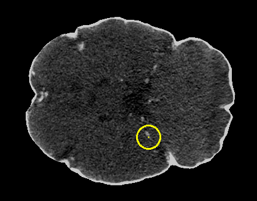

# `draw_2D_annotations`

Overlay 2D annotations from a CSV file onto an image, drawing circles, ellipses, or bounding boxes to visualize annotation locations.

```python
draw_2D_annotations(
    annotation_path: str,
    image_path: str,
    output_path: str,
    radius: int = 5,
    debug: bool = False
) -> None
```

## Overview

This function visualizes 2D annotations by drawing them directly on images. It reads annotation coordinates from a CSV file and overlays them as yellow markers (circles, ellipses, or rectangles) on the input image. The function supports three annotation formats commonly used in medical imaging and object detection tasks.

**Supported annotation types**:
1. **Center points**: Small circles marking point locations
2. **Bounding boxes**: Rectangles defining object boundaries
3. **Radius-based**: Ellipses with custom radii for each annotation

This is useful for:
- Visualizing detection or localization results
- Quality control of annotation datasets
- Verifying coordinate accuracy
- Creating figures for presentations or papers
- Debugging annotation extraction pipelines

<br><br>

## Parameters

| Name              | Type   | Default | Description                                                                                          |
|-------------------|--------|---------|------------------------------------------------------------------------------------------------------|
| `annotation_path` | `str`  | *required* | Path to the CSV annotation file containing coordinates.                                           |
| `image_path`      | `str`  | *required* | Path to the input image file (PNG, JPG, TIFF, etc.).                                              |
| `output_path`     | `str`  | *required* | Directory where the annotated image will be saved.                                                |
| `radius`          | `int`  | `5`     | Radius of circles drawn for center-point annotations (pixels).                                     |
| `debug`           | `bool` | `False` | If `True`, prints detailed information about the drawing process.                                  |

## Returns

`None` – The function saves the annotated image to disk.

## Output File

The annotated image is saved as:
```
<IMAGE_NAME>_annotated.<EXTENSION>
```

**Example**: Input `slice_042.tif` → Output `slice_042_annotated.tif`

### Visual Properties
- **Annotation color**: Yellow (BGR: 0, 255, 255)
- **Line thickness**: 2 pixels
- **Center points**: 1-pixel yellow dots
- **Image format**: Same as input (preserved)

## Annotation Formats

The function automatically detects and handles three CSV formats:

### Format 1: Center Points

**CSV Columns**: `CENTER_X`, `CENTER_Y`

**Drawing**: Circle with specified radius + center dot

**Example CSV**:
```csv
CENTER_X,CENTER_Y
120,150
340,280
```

**Use case**: Point annotations, landmarks, detection centers

### Format 2: Bounding Boxes

**CSV Columns**: `X_MIN`, `Y_MIN`, `X_MAX`, `Y_MAX`

**Drawing**: Rectangle from min to max coordinates

**Example CSV**:
```csv
X_MIN,Y_MIN,X_MAX,Y_MAX
100,120,180,200
300,250,380,330
```

**Use case**: Object detection, region proposals, lesion boundaries

### Format 3: Radius-Based (Ellipses)

**CSV Columns**: `CENTER_X`, `CENTER_Y`, `RADIUS_X`, `RADIUS_Y`

**Drawing**: Ellipse with custom radii + center dot

**Example CSV**:
```csv
CENTER_X,CENTER_Y,RADIUS_X,RADIUS_Y
120,150,30,20
340,280,25,25
```

**Use case**: Size-aware annotations, variable-sized objects, anisotropic structures

## Image Format Support

Supported input formats (via OpenCV):
- PNG (`.png`)
- JPEG (`.jpg`, `.jpeg`)
- TIFF (`.tif`, `.tiff`)
- BMP (`.bmp`)
- Other OpenCV-supported formats

**Automatic conversions**:
- Grayscale → 3-channel BGR
- RGBA → 3-channel BGR

## Exceptions

| Exception            | Condition                                                          |
|----------------------|--------------------------------------------------------------------|
| `FileNotFoundError`  | Annotation file or image file does not exist                      |
| `ValueError`         | CSV contains NaN values                                           |
| `ValueError`         | CSV is in volume format (contains Z coordinates)                  |
| `ValueError`         | CSV columns don't match any supported format                      |
| `ValueError`         | Image failed to load                                              |

## Usage Notes

- **Slice Format Only**: Function only supports 2D slice annotations, not 3D volume annotations
- **Coordinate System**: Coordinates must be in pixel indices (0-based)
- **Color**: All annotations drawn in yellow for high visibility
- **Image Modification**: Creates new image, does not modify original
- **Output Directory**: Automatically created if it doesn't exist
- **Multiple Annotations**: All annotations from CSV drawn on same image

## Examples

### Basic Usage - Center Points
Draw center point annotations:

```python
from nidataset.draw import draw_2D_annotations

draw_2D_annotations(
    annotation_path="labels/slice_042_centers.csv",
    image_path="images/slice_042.tif",
    output_path="annotated/",
    radius=8
)
# Output: annotated/slice_042_annotated.tif
```

### Bounding Box Annotations
Visualize detection boxes:

```python
draw_2D_annotations(
    annotation_path="detections/slice_042_boxes.csv",
    image_path="images/slice_042.tif",
    output_path="visualizations/",
    debug=True
)
# Prints: Drew 15 bounding boxes.
# Annotated image saved at: 'visualizations/slice_042_annotated.tif'
```

### Radius-Based Annotations
Draw ellipses with custom sizes:

```python
draw_2D_annotations(
    annotation_path="lesions/slice_042_radii.csv",
    image_path="images/slice_042.tif",
    output_path="lesion_overlays/",
    debug=True
)
# Prints: Drew 8 radius-based annotations (ellipses).
```

### Custom Radius for Center Points
Adjust circle size for visibility:

```python
draw_2D_annotations(
    annotation_path="landmarks/centers.csv",
    image_path="scans/brain_slice.tif",
    output_path="marked/",
    radius=12,  # Larger circles for better visibility
    debug=True
)
```

### Batch Processing
Annotate multiple images:

```python
import os
from nidataset.draw import draw_2D_annotations

annotation_folder = "annotations/"
image_folder = "images/"
output_folder = "annotated_images/"

# Match annotations to images
for csv_file in os.listdir(annotation_folder):
    if csv_file.endswith('.csv'):
        # Extract base name (assumes matching naming)
        base_name = csv_file.replace('.csv', '')
        
        # Find corresponding image
        for ext in ['.tif', '.png', '.jpg']:
            image_file = base_name + ext
            image_path = os.path.join(image_folder, image_file)
            
            if os.path.exists(image_path):
                print(f"Processing: {base_name}")
                
                draw_2D_annotations(
                    annotation_path=os.path.join(annotation_folder, csv_file),
                    image_path=image_path,
                    output_path=output_folder,
                    radius=6,
                    debug=True
                )
                break
```

### Quality Control Workflow
Verify annotation accuracy:

```python
import pandas as pd
from nidataset.draw import draw_2D_annotations

# Load annotations to check
annotations = pd.read_csv("qa/annotations.csv")

print("Annotation Quality Check:")
print(f"  Total annotations: {len(annotations)}")
print(f"  Columns: {annotations.columns.tolist()}")

# Check for issues
if annotations.isnull().any().any():
    print("  Warning: Contains NaN values")
else:
    print("  ✓ No NaN values")

# Draw annotations
draw_2D_annotations(
    annotation_path="qa/annotations.csv",
    image_path="qa/test_image.tif",
    output_path="qa/visualized/",
    radius=8,
    debug=True
)

print("\nReview 'qa/visualized/test_image_annotated.tif' for accuracy")
```

### Comparing Detection Results
Visualize model predictions:

```python
from nidataset.draw import draw_2D_annotations
import shutil

# Ground truth annotations
draw_2D_annotations(
    annotation_path="ground_truth/slice_042.csv",
    image_path="images/slice_042.tif",
    output_path="comparison/ground_truth/",
    radius=6,
    debug=True
)

# Model predictions
draw_2D_annotations(
    annotation_path="predictions/slice_042.csv",
    image_path="images/slice_042.tif",
    output_path="comparison/predictions/",
    radius=6,
    debug=True
)

print("Compare ground_truth and predictions folders visually")
```

### Creating Presentation Figures
Generate annotated images for reports:

```python
from nidataset.draw import draw_2D_annotations

# Representative slices with annotations
representative_slices = [
    ('slice_020', 'lesion'),
    ('slice_045', 'lesion'),
    ('slice_067', 'lesion')
]

for slice_name, annotation_type in representative_slices:
    draw_2D_annotations(
        annotation_path=f"annotations/{slice_name}_{annotation_type}.csv",
        image_path=f"images/{slice_name}.tif",
        output_path="figures/",
        radius=10,  # Larger for presentation
        debug=True
    )

print("Presentation figures ready in figures/ folder")
```

### Handling Different Annotation Formats
Process mixed annotation types:

```python
import pandas as pd
from nidataset.draw import draw_2D_annotations

def identify_annotation_format(csv_path):
    """Identify which format the CSV uses."""
    df = pd.read_csv(csv_path)
    
    if 'RADIUS_X' in df.columns and 'RADIUS_Y' in df.columns:
        return 'radius'
    elif 'X_MIN' in df.columns and 'X_MAX' in df.columns:
        return 'bbox'
    elif 'CENTER_X' in df.columns and 'CENTER_Y' in df.columns:
        return 'center'
    else:
        return 'unknown'

# Process based on format
annotation_file = "mixed_annotations/slice_042.csv"
format_type = identify_annotation_format(annotation_file)

print(f"Detected format: {format_type}")

draw_2D_annotations(
    annotation_path=annotation_file,
    image_path="images/slice_042.tif",
    output_path="annotated/",
    radius=7,
    debug=True
)
```

### Creating Training Data Visualizations
Visualize training dataset:

```python
import os
from nidataset.draw import draw_2D_annotations

# Visualize training samples
train_annotations = "training/labels/"
train_images = "training/images/"
train_visualized = "training/visualized/"

annotation_files = [f for f in os.listdir(train_annotations) if f.endswith('.csv')]

print(f"Visualizing {len(annotation_files)} training samples...")

for i, csv_file in enumerate(annotation_files[:20], 1):  # First 20 samples
    base_name = csv_file.replace('.csv', '')
    
    # Assume corresponding .tif image
    image_file = base_name + '.tif'
    
    if os.path.exists(os.path.join(train_images, image_file)):
        draw_2D_annotations(
            annotation_path=os.path.join(train_annotations, csv_file),
            image_path=os.path.join(train_images, image_file),
            output_path=train_visualized,
            radius=5,
            debug=False
        )
        
        if i % 5 == 0:
            print(f"  Processed {i} samples...")

print(f"\nVisualized samples saved in {train_visualized}")
```

### Error Handling
Robust processing with validation:

```python
from nidataset.draw import draw_2D_annotations
import os

def safe_draw_annotations(annotation_path, image_path, output_path):
    """Draw annotations with comprehensive error handling."""
    
    # Check files exist
    if not os.path.exists(annotation_path):
        print(f"✗ Annotation file not found: {annotation_path}")
        return False
    
    if not os.path.exists(image_path):
        print(f"✗ Image file not found: {image_path}")
        return False
    
    try:
        draw_2D_annotations(
            annotation_path=annotation_path,
            image_path=image_path,
            output_path=output_path,
            radius=6,
            debug=True
        )
        print(f"✓ Successfully annotated")
        return True
        
    except ValueError as e:
        print(f"✗ Invalid data: {e}")
        return False
        
    except Exception as e:
        print(f"✗ Unexpected error: {e}")
        return False

# Use with error handling
safe_draw_annotations(
    "annotations/slice_042.csv",
    "images/slice_042.tif",
    "output/"
)
```

### Analyzing Annotation Distribution
Visualize and analyze:

```python
import pandas as pd
import matplotlib.pyplot as plt
from nidataset.draw import draw_2D_annotations

# Load annotations
annotations = pd.read_csv("analysis/annotations.csv")

# Analyze distribution
print("Annotation Analysis:")
print(f"  Total annotations: {len(annotations)}")

if 'CENTER_X' in annotations.columns:
    print(f"  X range: [{annotations['CENTER_X'].min():.0f}, {annotations['CENTER_X'].max():.0f}]")
    print(f"  Y range: [{annotations['CENTER_Y'].min():.0f}, {annotations['CENTER_Y'].max():.0f}]")
    
    # Plot distribution
    plt.figure(figsize=(10, 5))
    
    plt.subplot(1, 2, 1)
    plt.hist(annotations['CENTER_X'], bins=20, alpha=0.7)
    plt.xlabel('X Coordinate')
    plt.ylabel('Count')
    plt.title('X Distribution')
    
    plt.subplot(1, 2, 2)
    plt.hist(annotations['CENTER_Y'], bins=20, alpha=0.7)
    plt.xlabel('Y Coordinate')
    plt.ylabel('Count')
    plt.title('Y Distribution')
    
    plt.tight_layout()
    plt.savefig('annotation_distribution.png')
    print("  Distribution plot saved")

# Visualize on image
draw_2D_annotations(
    annotation_path="analysis/annotations.csv",
    image_path="analysis/image.tif",
    output_path="analysis/visualized/",
    radius=7,
    debug=True
)
```

### Creating Dataset Documentation
Generate annotated examples for documentation:

```python
from nidataset.draw import draw_2D_annotations

# Example annotations for each format
examples = {
    'center_points': {
        'annotation': 'docs/examples/centers.csv',
        'image': 'docs/examples/sample.tif',
        'description': 'Center point annotations'
    },
    'bounding_boxes': {
        'annotation': 'docs/examples/boxes.csv',
        'image': 'docs/examples/sample.tif',
        'description': 'Bounding box annotations'
    },
    'radius_based': {
        'annotation': 'docs/examples/radii.csv',
        'image': 'docs/examples/sample.tif',
        'description': 'Radius-based annotations'
    }
}

print("Creating documentation examples...")

for format_name, config in examples.items():
    print(f"\n{config['description']}:")
    
    draw_2D_annotations(
        annotation_path=config['annotation'],
        image_path=config['image'],
        output_path=f"docs/figures/{format_name}/",
        radius=8,
        debug=True
    )

print("\nDocumentation figures created")
```

## Typical Workflow

```python
from nidataset.draw import draw_2D_annotations
import pandas as pd

# 1. Check annotation format
annotations = pd.read_csv("annotations/slice_042.csv")
print(f"Annotation format: {annotations.columns.tolist()}")
print(f"Total annotations: {len(annotations)}")

# 2. Draw annotations on image
draw_2D_annotations(
    annotation_path="annotations/slice_042.csv",
    image_path="images/slice_042.tif",
    output_path="visualized/",
    radius=6,
    debug=True
)

# 3. Review annotated image
# Open 'visualized/slice_042_annotated.tif' in image viewer

# 4. Use annotated images for:
# - Quality control of annotations
# - Presentation and documentation
# - Verification of coordinate accuracy
# - Debugging annotation pipelines
```