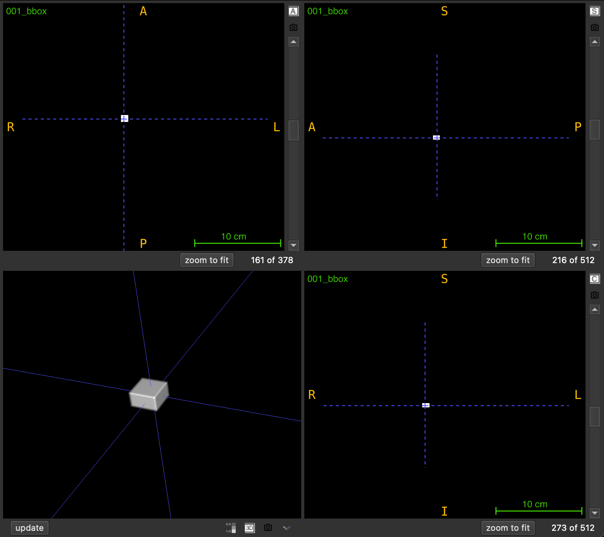

# `draw_3D_boxes`

Create a NIfTI mask volume by drawing 3D bounding boxes from a dataframe onto a reference image, optionally color-coding boxes by confidence score.

```python
draw_3D_boxes(
    df: pd.DataFrame,
    nii_path: str,
    output_path: str,
    intensity_based_on_score: bool = False,
    debug: bool = False
) -> None
```

## Overview

This function generates a 3D mask by overlaying bounding boxes onto a reference NIfTI volume. Each box is defined by minimum and maximum coordinates in voxel space, and the resulting mask inherits the spatial metadata (affine transformation and shape) from the reference image.

Common use cases include:
- Visualizing detection or localization results
- Creating region-of-interest masks from predicted bounding boxes
- Generating training labels for segmentation models
- Quality control of automated detection algorithms

The output is saved as `<FILENAME>_boxes.nii.gz` and can be loaded in any NIfTI viewer for visualization.

<br><br>

## Parameters

| Name                       | Type           | Default    | Description                                                                                          |
|----------------------------|----------------|------------|------------------------------------------------------------------------------------------------------|
| `df`                       | `pd.DataFrame` | *required* | Dataframe containing bounding box coordinates. See required columns below.                          |
| `nii_path`                 | `str`          | *required* | Path to the reference `.nii.gz` file. Provides shape and affine transformation for the output.      |
| `output_path`              | `str`          | *required* | Directory where the output file will be saved. Created automatically if it doesn't exist.           |
| `intensity_based_on_score` | `bool`         | `False`    | If `True`, assigns different intensities based on score thresholds. If `False`, all boxes use intensity 1. |
| `debug`                    | `bool`         | `False`    | If `True`, prints the output file path and processing information.                                  |

## Required Dataframe Columns

The input dataframe must contain these columns:

| Column   | Type    | Description                                    |
|----------|---------|------------------------------------------------|
| `X_MIN`  | numeric | Minimum X coordinate (voxel index)            |
| `Y_MIN`  | numeric | Minimum Y coordinate (voxel index)            |
| `Z_MIN`  | numeric | Minimum Z coordinate (voxel index)            |
| `X_MAX`  | numeric | Maximum X coordinate (voxel index)            |
| `Y_MAX`  | numeric | Maximum Y coordinate (voxel index)            |
| `Z_MAX`  | numeric | Maximum Z coordinate (voxel index)            |
| `SCORE`  | numeric | Confidence score (required only if `intensity_based_on_score=True`) |

**Important**: Coordinates must be in voxel space (0-indexed) matching the reference image dimensions.

## Returns

`None` – The function saves the output to disk.

## Output File

The generated mask is saved as:
```
<PREFIX>_boxes.nii.gz
```
where `<PREFIX>` is the reference image filename without the `.nii.gz` extension.

**Example**: Reference `scan_001.nii.gz` → Output `scan_001_boxes.nii.gz`

## Intensity Assignment

### Default Mode (`intensity_based_on_score=False`)
All bounding box voxels are assigned intensity value `1`.

### Score-Based Mode (`intensity_based_on_score=True`)
Voxel intensities are assigned based on the `SCORE` column using three tiers:

| Score Range      | Intensity Value | Interpretation        |
|------------------|----------------|-----------------------|
| score ≤ 0.50     | 1              | Low confidence        |
| 0.50 < score ≤ 0.75 | 2           | Medium confidence     |
| score > 0.75     | 3              | High confidence       |

This allows visual differentiation of boxes by confidence level in image viewers.

## Exceptions

| Exception            | Condition                                                          |
|----------------------|--------------------------------------------------------------------|
| `FileNotFoundError`  | The reference file at `nii_path` does not exist                   |
| `ValueError`         | The file is not in `.nii.gz` format                               |
| `ValueError`         | Required columns are missing from the dataframe                   |
| `ValueError`         | The dataframe contains NaN values                                 |

## Usage Notes

- **Coordinate System**: All coordinates must be in voxel indices (0-indexed)
- **Overlapping Boxes**: If boxes overlap, later boxes in the dataframe overwrite earlier ones
- **Spatial Alignment**: The output mask uses the same affine transformation as the reference image
- **Empty Background**: All voxels not within any box are set to 0
- **Output Directory**: Automatically created if it doesn't exist

## Examples

### Basic Usage
Draw boxes without score-based coloring:

```python
import pandas as pd
from nidataset.draw import draw_3D_boxes

# Define bounding boxes
boxes = pd.DataFrame({
    'X_MIN': [10, 50],
    'Y_MIN': [15, 55],
    'Z_MIN': [20, 60],
    'X_MAX': [30, 70],
    'Y_MAX': [35, 75],
    'Z_MAX': [40, 80]
})

draw_3D_boxes(
    df=boxes,
    nii_path="scans/patient_001.nii.gz",
    output_path="visualizations/",
    intensity_based_on_score=False
)
# Output: visualizations/patient_001_boxes.nii.gz (all boxes with intensity 1)
```

### Score-Based Intensity
Color-code boxes by confidence scores:

```python
import pandas as pd
from nidataset.draw import draw_3D_boxes

# Define boxes with confidence scores
boxes = pd.DataFrame({
    'SCORE': [0.30, 0.65, 0.85],
    'X_MIN': [10, 40, 70],
    'Y_MIN': [12, 42, 72],
    'Z_MIN': [14, 44, 74],
    'X_MAX': [20, 50, 80],
    'Y_MAX': [22, 52, 82],
    'Z_MAX': [24, 54, 84]
})

draw_3D_boxes(
    df=boxes,
    nii_path="scans/detection_input.nii.gz",
    output_path="results/detections/",
    intensity_based_on_score=True,
    debug=True
)
# Output boxes with intensities: 1 (low), 2 (medium), 3 (high)
# Prints: Boxes draw saved at: 'results/detections/detection_input_boxes.nii.gz'
```

### Visualizing Detection Results
Convert model predictions to a viewable mask:

```python
import pandas as pd
import nibabel as nib
from nidataset.draw import draw_3D_boxes

# Simulated detection results from a model
detections = pd.DataFrame({
    'SCORE': [0.92, 0.87, 0.45, 0.78],
    'X_MIN': [45, 120, 200, 80],
    'Y_MIN': [50, 125, 205, 85],
    'Z_MIN': [30, 40, 50, 35],
    'X_MAX': [65, 140, 220, 100],
    'Y_MAX': [70, 145, 225, 105],
    'Z_MAX': [50, 60, 70, 55]
})

# Create visualization mask
draw_3D_boxes(
    df=detections,
    nii_path="test_data/scan_042.nii.gz",
    output_path="predictions/visual/",
    intensity_based_on_score=True,
    debug=True
)

# Load and verify
mask = nib.load("predictions/visual/scan_042_boxes.nii.gz")
print(f"Created mask with shape: {mask.shape}")
print(f"Unique intensities: {np.unique(mask.get_fdata())}")
# Output: [0, 1, 2, 3] representing background, low, medium, high confidence
```

### Filtering and Drawing High-Confidence Boxes
Select and visualize only high-confidence detections:

```python
import pandas as pd
from nidataset.draw import draw_3D_boxes

# Full detection results
all_detections = pd.DataFrame({
    'SCORE': [0.95, 0.45, 0.88, 0.30, 0.91],
    'X_MIN': [10, 30, 50, 70, 90],
    'Y_MIN': [15, 35, 55, 75, 95],
    'Z_MIN': [20, 40, 60, 80, 100],
    'X_MAX': [25, 45, 65, 85, 105],
    'Y_MAX': [30, 50, 70, 90, 110],
    'Z_MAX': [35, 55, 75, 95, 115]
})

# Filter to high confidence only (score > 0.8)
high_conf = all_detections[all_detections['SCORE'] > 0.8].copy()

draw_3D_boxes(
    df=high_conf,
    nii_path="images/scan.nii.gz",
    output_path="filtered_results/",
    intensity_based_on_score=False,
    debug=True
)
print(f"Drew {len(high_conf)} high-confidence boxes")
```

### Batch Processing Multiple Images
Process detection results for an entire dataset:

```python
import pandas as pd
import os
from nidataset.draw import draw_3D_boxes

# Dictionary mapping image files to their detection results
detections_dict = {
    'case_001.nii.gz': pd.DataFrame({
        'SCORE': [0.9, 0.7],
        'X_MIN': [10, 40], 'Y_MIN': [12, 42], 'Z_MIN': [14, 44],
        'X_MAX': [20, 50], 'Y_MAX': [22, 52], 'Z_MAX': [24, 54]
    }),
    'case_002.nii.gz': pd.DataFrame({
        'SCORE': [0.85],
        'X_MIN': [30], 'Y_MIN': [32], 'Z_MIN': [34],
        'X_MAX': [45], 'Y_MAX': [47], 'Z_MAX': [49]
    })
}

input_folder = "images/"
output_folder = "visualizations/"

for filename, boxes_df in detections_dict.items():
    draw_3D_boxes(
        df=boxes_df,
        nii_path=os.path.join(input_folder, filename),
        output_path=output_folder,
        intensity_based_on_score=True,
        debug=True
    )
```

### Creating Region-of-Interest Masks
Generate binary masks for specific regions:

```python
import pandas as pd
from nidataset.draw import draw_3D_boxes

# Define regions of interest
roi_boxes = pd.DataFrame({
    'X_MIN': [100],
    'Y_MIN': [100],
    'Z_MIN': [50],
    'X_MAX': [150],
    'Y_MAX': [150],
    'Z_MAX': [80]
})

# Create binary ROI mask
draw_3D_boxes(
    df=roi_boxes,
    nii_path="full_scan.nii.gz",
    output_path="roi_masks/",
    intensity_based_on_score=False
)
# Output: Binary mask with 1 inside ROI, 0 outside
```

## Typical Workflow

```python
import pandas as pd
from nidataset.draw import draw_3D_boxes

# 1. Load or create detection results
detections = pd.read_csv("model_predictions.csv")

# 2. Ensure required columns are present
required = ['SCORE', 'X_MIN', 'Y_MIN', 'Z_MIN', 'X_MAX', 'Y_MAX', 'Z_MAX']
assert all(col in detections.columns for col in required)

# 3. Draw boxes on reference image
draw_3D_boxes(
    df=detections,
    nii_path="test_scans/patient_scan.nii.gz",
    output_path="detection_visualizations/",
    intensity_based_on_score=True,
    debug=True
)

# 4. Load in viewer (e.g., ITK-SNAP, 3D Slicer) for visual inspection
# The output mask can be overlaid on the original scan
```