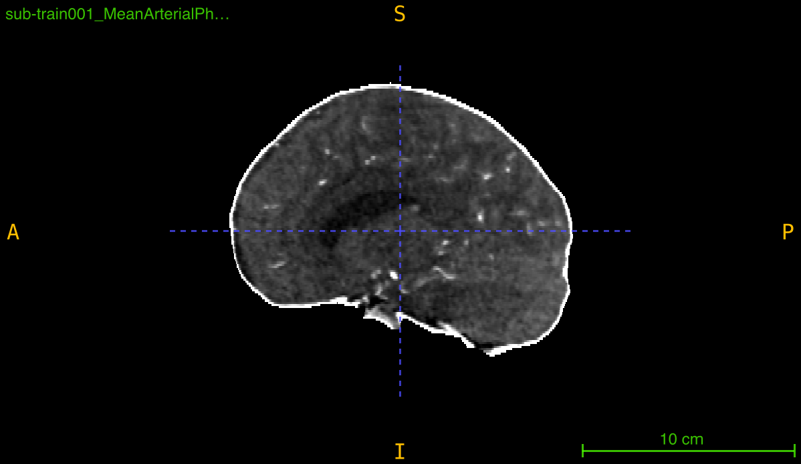
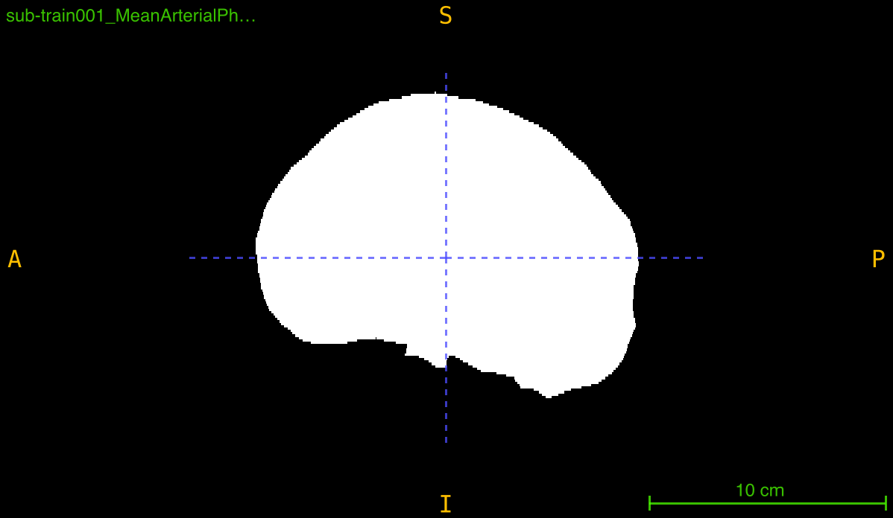

# `generate_brain_mask`

Generate a binary brain tissue mask from a medical imaging volume using intensity thresholding, morphological operations, and connected component analysis.

```python
generate_brain_mask(
    nii_path: str,
    output_path: str,
    threshold: tuple = None,
    closing_radius: int = 3,
    debug: bool = False
) -> None
```

## Overview

This function creates a binary mask that isolates brain tissue from background and skull by applying a multi-step segmentation pipeline:

1. **Thresholding**: Segments tissue based on intensity values (manual or automatic Otsu)
2. **Hole filling**: Fills small gaps within the segmented region
3. **Morphological closing**: Smooths boundaries and connects nearby regions
4. **Component selection**: Keeps only the largest connected component (assumed to be brain)

The result is a clean, connected binary mask suitable for skull stripping, region of interest extraction, or preprocessing pipelines.

<br>  <br>
<br>  <br>

## Parameters

| Name             | Type              | Default | Description                                                                                          |
|------------------|-------------------|---------|------------------------------------------------------------------------------------------------------|
| `nii_path`       | `str`             | *required* | Path to the input medical volume in `.nii.gz` format.                                             |
| `output_path`    | `str`             | *required* | Directory where the brain mask will be saved. Created automatically if it doesn't exist.          |
| `threshold`      | `tuple` or `None` | `None`  | Intensity range `(low, high)` for segmentation. If `None`, uses automatic Otsu thresholding.        |
| `closing_radius` | `int`             | `3`     | Radius in voxels for morphological closing to refine mask boundaries.                                |
| `debug`          | `bool`            | `False` | If `True`, prints diagnostic information including thresholds and file paths.                        |

## Returns

`None` – The function saves the binary mask to disk.

## Output File

The mask is saved as:
```
<PREFIX>_brain_mask.nii.gz
```
where `<PREFIX>` is the original filename without the `.nii.gz` extension.

**Example**: Input `scan_001.nii.gz` → Output `scan_001_brain_mask.nii.gz`

### Output Mask Properties
- **Data type**: uint8 (8-bit unsigned integer)
- **Tissue voxels**: Value `1`
- **Background**: Value `0`
- **Dimensions**: Same as input volume
- **Spatial metadata**: Inherits affine transformation from input

## Thresholding Strategies

### Automatic Thresholding (`threshold=None`)
Uses Otsu's method with adaptive bounds:
```python
otsu_value = threshold_otsu(non_zero_voxels)
lower_bound = otsu_value × 0.5  # Relaxed to capture soft tissue
upper_bound = otsu_value × 2.0  # Extended to include bright regions
```

**Advantages**:
- Adapts to different intensity distributions
- No manual parameter tuning
- Works across different scanners and protocols

**When to use**: Variable intensity ranges, mixed datasets, initial exploration

### Manual Thresholding (`threshold=(low, high)`)
Uses fixed intensity bounds for all scans:
```python
binary_mask = (intensity >= low) & (intensity <= high)
```

**Advantages**:
- Consistent segmentation across dataset
- Precise control over tissue selection
- Reproducible results

**When to use**: Homogeneous datasets, known intensity ranges, production pipelines

**Example intensity ranges**:
- CT with contrast: `(50, 300)` for brain tissue
- CT plain: `(20, 100)` for soft tissue
- MRI T1: `(50, 200)` typical brain
- MRI T2: `(100, 500)` typical brain

## Segmentation Pipeline Details

### Step 1: Initial Thresholding
Creates a binary mask based on intensity values:
```python
binary_mask = (data >= lower) & (data <= upper)
```

### Step 2: Hole Filling
Fills internal gaps that might be caused by blood vessels or ventricles:
```python
filled_mask = binary_fill_holes(binary_mask)
```

### Step 3: Morphological Closing
Smooths boundaries and connects nearby regions using a spherical structuring element:
```python
closed_mask = binary_closing(filled_mask, ball(closing_radius))
```

**Closing radius effects**:
- **Radius 1-2**: Minimal smoothing, preserves details
- **Radius 3-4**: Moderate smoothing, typical use
- **Radius 5+**: Aggressive smoothing, may lose small structures

### Step 4: Largest Component Selection
Keeps only the largest connected component (assumed to be the brain):
```python
labeled = label(closed_mask)
brain_mask = labeled == largest_component_label
```

This removes disconnected artifacts, noise, and small false positives.

## Exceptions

| Exception            | Condition                                                          |
|----------------------|--------------------------------------------------------------------|
| `FileNotFoundError`  | The input file does not exist                                     |
| `ValueError`         | File is not in `.nii.gz` format                                   |
| `ValueError`         | Input is not a 3D volume                                          |
| `ValueError`         | Threshold tuple does not contain exactly 2 values                 |

## Usage Notes

- **Input Format**: Only `.nii.gz` files are accepted
- **3D Volumes Required**: Input must be a 3D NIfTI image
- **Output Directory**: Automatically created if it doesn't exist
- **Single Component**: Only the largest connected component is retained
- **Intensity Units**: Ensure threshold values match your scan's intensity scale

## Examples

### Basic Usage - Automatic Thresholding
Generate mask with automatic Otsu thresholding:

```python
from nidataset.volume import generate_brain_mask

generate_brain_mask(
    nii_path="scans/patient_001.nii.gz",
    output_path="masks/",
    threshold=None,
    closing_radius=3
)
# Output: masks/patient_001_brain_mask.nii.gz
```

### With Debug Information
Enable verbose output to see threshold values:

```python
generate_brain_mask(
    nii_path="ct_scans/brain_scan.nii.gz",
    output_path="brain_masks/",
    threshold=None,
    closing_radius=3,
    debug=True
)
# Prints:
# Using Otsu's threshold: 125.50
# Adjusted range: (62.75, 251.00)
# Input file: 'ct_scans/brain_scan.nii.gz'
# Output path: 'brain_masks/'
# Brain mask saved at: brain_masks/brain_scan_brain_mask.nii.gz
```

### Manual Thresholding
Use fixed intensity bounds for consistent segmentation:

```python
generate_brain_mask(
    nii_path="data/scan.nii.gz",
    output_path="data/masks/",
    threshold=(50, 300),  # CT brain tissue range
    closing_radius=3,
    debug=True
)
```

### Fine-Tuned Morphological Processing
Adjust closing radius for different characteristics:

```python
# Conservative closing for detailed structures
generate_brain_mask(
    nii_path="high_res_scan.nii.gz",
    output_path="detailed_masks/",
    threshold=(40, 200),
    closing_radius=2,  # Minimal smoothing
    debug=True
)

# Aggressive closing for noisy data
generate_brain_mask(
    nii_path="noisy_scan.nii.gz",
    output_path="smooth_masks/",
    threshold=(50, 250),
    closing_radius=6,  # Strong smoothing
    debug=True
)
```

### Finding Optimal Threshold
Test different thresholds to determine best settings:

```python
import nibabel as nib
import numpy as np
from nidataset.volume import generate_brain_mask

test_thresholds = [
    (30, 200),
    (50, 250),
    (70, 300),
    None  # Automatic
]

scan_file = "test_scan.nii.gz"

for i, thresh in enumerate(test_thresholds):
    output_folder = f"threshold_test/test_{i}/"
    
    generate_brain_mask(
        nii_path=scan_file,
        output_path=output_folder,
        threshold=thresh,
        closing_radius=3,
        debug=True
    )
    
    # Analyze result
    mask = nib.load(f"{output_folder}/test_scan_brain_mask.nii.gz")
    mask_data = mask.get_fdata()
    
    brain_voxels = np.sum(mask_data > 0)
    total_voxels = np.prod(mask_data.shape)
    coverage = (brain_voxels / total_voxels) * 100
    
    thresh_str = f"{thresh[0]}-{thresh[1]}" if thresh else "Otsu"
    print(f"Threshold {thresh_str}: Coverage = {coverage:.1f}%")

print("\nVisually inspect outputs to select best threshold")
```

### Quality Control Verification
Generate mask and verify quality:

```python
import nibabel as nib
import numpy as np
from nidataset.volume import generate_brain_mask

# Generate mask
generate_brain_mask(
    nii_path="qa/test_scan.nii.gz",
    output_path="qa/masks/",
    threshold=(50, 300),
    closing_radius=3,
    debug=True
)

# Load and verify
scan = nib.load("qa/test_scan.nii.gz")
mask = nib.load("qa/masks/test_scan_brain_mask.nii.gz")

scan_data = scan.get_fdata()
mask_data = mask.get_fdata()

# Quality metrics
brain_voxels = np.sum(mask_data > 0)
total_voxels = np.prod(mask_data.shape)
coverage = (brain_voxels / total_voxels) * 100

# Check mask properties
unique_values = np.unique(mask_data)
num_components = len(np.unique(mask_data)) - 1  # Exclude background

print(f"\nQuality Control Report:")
print(f"  Scan shape: {scan_data.shape}")
print(f"  Mask shape: {mask_data.shape}")
print(f"  Brain coverage: {coverage:.1f}%")
print(f"  Mask values: {unique_values}")
print(f"  Number of components: {num_components}")

# Expected values
if coverage < 20 or coverage > 60:
    print("  Warning: Unusual coverage, review threshold")
if num_components > 1:
    print("  Warning: Multiple components detected")
else:
    print("  Mask looks good")
```

### Applying Mask to Original Scan
Use mask for skull stripping:

```python
import nibabel as nib
from nidataset.volume import generate_brain_mask

scan_file = "scans/patient_042.nii.gz"
mask_output = "masks/"
stripped_output = "skull_stripped/"

# Generate mask
generate_brain_mask(
    nii_path=scan_file,
    output_path=mask_output,
    threshold=(50, 300),
    closing_radius=4,
    debug=True
)

# Load scan and mask
scan = nib.load(scan_file)
scan_data = scan.get_fdata()

mask = nib.load(f"{mask_output}/patient_042_brain_mask.nii.gz")
mask_data = mask.get_fdata()

# Apply mask (skull stripping)
stripped_data = scan_data * mask_data

# Save skull-stripped scan
os.makedirs(stripped_output, exist_ok=True)
stripped_img = nib.Nifti1Image(stripped_data, scan.affine)
nib.save(stripped_img, f"{stripped_output}/patient_042_stripped.nii.gz")

print("Skull stripping complete")
```

### Comparing Different Closing Radii
Test morphological processing parameters:

```python
import nibabel as nib
import numpy as np
from nidataset.volume import generate_brain_mask

radii = [2, 3, 4, 5, 6]
scan_file = "test_data/scan.nii.gz"

for radius in radii:
    output_folder = f"closing_test/radius_{radius}/"
    
    generate_brain_mask(
        nii_path=scan_file,
        output_path=output_folder,
        threshold=(50, 300),
        closing_radius=radius,
        debug=True
    )
    
    # Analyze smoothness (via surface area proxy)
    mask = nib.load(f"{output_folder}/scan_brain_mask.nii.gz")
    mask_data = mask.get_fdata()
    
    # Count edge voxels
    from scipy import ndimage
    edges = ndimage.sobel(mask_data)
    edge_voxels = np.sum(edges > 0)
    
    print(f"Radius {radius}: Edge voxels = {edge_voxels}")

print("\nSmaller edge count = smoother mask")
```

### Integration with Preprocessing Pipeline
Use masks in a complete preprocessing workflow:

```python
import nibabel as nib
import numpy as np
from nidataset.volume import generate_brain_mask

def preprocess_scan(input_path, output_path):
    """Complete preprocessing with skull stripping and normalization."""
    
    # Step 1: Generate brain mask
    generate_brain_mask(
        nii_path=input_path,
        output_path="temp_masks/",
        threshold=(50, 300),
        closing_radius=3,
        debug=True
    )
    
    # Step 2: Load scan and mask
    scan = nib.load(input_path)
    scan_data = scan.get_fdata()
    
    filename = os.path.basename(input_path)
    mask_file = filename.replace('.nii.gz', '_brain_mask.nii.gz')
    mask = nib.load(f"temp_masks/{mask_file}")
    mask_data = mask.get_fdata()
    
    # Step 3: Apply mask
    brain_only = scan_data * mask_data
    
    # Step 4: Normalize intensities within mask
    brain_voxels = brain_only[mask_data > 0]
    mean_intensity = brain_voxels.mean()
    std_intensity = brain_voxels.std()
    
    normalized = np.zeros_like(brain_only)
    normalized[mask_data > 0] = (brain_voxels - mean_intensity) / std_intensity
    
    # Step 5: Save preprocessed scan
    preprocessed = nib.Nifti1Image(normalized, scan.affine)
    nib.save(preprocessed, output_path)
    
    print(f"Preprocessed scan saved to {output_path}")
    return output_path

# Use in pipeline
preprocess_scan(
    "raw_scans/patient_001.nii.gz",
    "preprocessed/patient_001_preprocessed.nii.gz"
)
```

### Batch Processing with Parameter Optimization
Process dataset with optimized parameters per scan type:

```python
from nidataset.volume import generate_brain_mask
import json

# Load scan metadata
with open('scan_metadata.json', 'r') as f:
    metadata = json.load(f)

for scan_id, info in metadata.items():
    scan_file = f"scans/{scan_id}.nii.gz"
    
    # Select parameters based on scan type
    if info['modality'] == 'CT_contrast':
        thresh = (50, 300)
        radius = 3
    elif info['modality'] == 'CT_plain':
        thresh = (20, 100)
        radius = 4
    elif info['modality'] == 'MRI_T1':
        thresh = None  # Automatic
        radius = 3
    else:
        continue
    
    generate_brain_mask(
        nii_path=scan_file,
        output_path=f"masks/{info['modality']}/",
        threshold=thresh,
        closing_radius=radius,
        debug=True
    )
    
    print(f"Processed {scan_id} ({info['modality']})")
```

### Creating Visualization Overlay
Generate mask overlay for quality inspection:

```python
import nibabel as nib
import numpy as np
from nidataset.volume import generate_brain_mask

scan_file = "visualization/scan.nii.gz"

# Generate mask
generate_brain_mask(
    nii_path=scan_file,
    output_path="visualization/masks/",
    threshold=(50, 300),
    closing_radius=3
)

# Load scan and mask
scan = nib.load(scan_file)
scan_data = scan.get_fdata()

mask = nib.load("visualization/masks/scan_brain_mask.nii.gz")
mask_data = mask.get_fdata()

# Create overlay with mask boundary highlighted
from scipy import ndimage
edges = ndimage.sobel(mask_data)

overlay = scan_data.copy()
overlay[edges > 0] = scan_data.max()  # Bright edge highlighting

# Save overlay
overlay_img = nib.Nifti1Image(overlay, scan.affine)
nib.save(overlay_img, "visualization/overlay_with_mask.nii.gz")
print("Overlay created for visual inspection in viewer")
```

## Typical Workflow

```python
from nidataset.volume import generate_brain_mask
import nibabel as nib
import numpy as np

# 1. Generate brain mask
scan_file = "data/patient_scan.nii.gz"
mask_output = "data/masks/"

generate_brain_mask(
    nii_path=scan_file,
    output_path=mask_output,
    threshold=(50, 300),  # Adjust for your modality
    closing_radius=3,
    debug=True
)

# 2. Verify mask quality
mask = nib.load("data/masks/patient_scan_brain_mask.nii.gz")
mask_data = mask.get_fdata()

coverage = np.sum(mask_data > 0) / np.prod(mask_data.shape) * 100
print(f"Brain coverage: {coverage:.1f}%")

# 3. Use mask for:
# - Skull stripping
# - Region of interest extraction
# - Focused analysis on brain tissue
# - Preprocessing before segmentation or classification
```