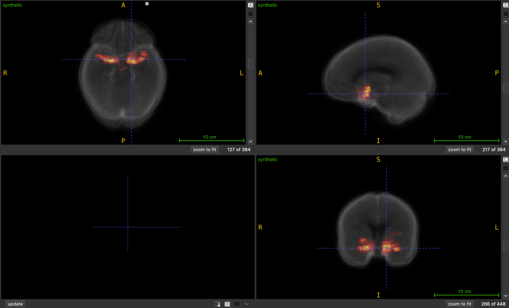

# `generate_heatmap_volume`

Generate a synthetic heatmap volume by summing all NIfTI files in a folder to visualize spatial overlap and accumulation.

```python
generate_heatmap_volume(
    nii_folder: str,
    output_path: str,
    output_filename: str = "heatmap_volume.nii.gz",
    use_mean: bool = True,
    clip_to_input_range: bool = True,
    normalize: bool = False,
    debug: bool = False
) -> None
```

## Overview

This function creates a heatmap volume by performing voxel-wise averaging (default) or summation across all NIfTI files in a specified folder. The resulting volume represents the spatial probability, overlap, accumulation, or density across all input volumes, making it useful for visualizing patterns, hotspots, or regions of interest across a dataset.

**Heatmap generation pipeline**:
1. **Discovery**: Locates all `.nii.gz` files in input folder
2. **Validation**: Ensures all volumes have matching shapes
3. **Accumulation**: Averages or sums voxel values across all volumes
4. **Processing**: Optionally clips to input range and/or normalizes
5. **Output**: Saves resulting heatmap with proper metadata

This is essential for:
- Creating probability maps from multiple segmentations
- Visualizing annotation density across datasets
- Generating overlap maps for bounding boxes or masks
- Creating consensus maps from multiple annotators
- Identifying hotspots or regions of high activity
- Building ensemble predictions from multiple models

<br>  <br>

## Parameters

| Name                    | Type   | Default                  | Description                                                                                          |
|-------------------------|--------|--------------------------|------------------------------------------------------------------------------------------------------|
| `nii_folder`            | `str`  | *required*               | Path to folder containing input NIfTI files (`.nii.gz`).                                            |
| `output_path`           | `str`  | *required*               | Directory where heatmap volume will be saved.                                                       |
| `output_filename`       | `str`  | `"heatmap_volume.nii.gz"`| Name of output heatmap file.                                                                        |
| `use_mean`              | `bool` | `True`                   | If `True`, computes mean (probability map). If `False`, sums values (density map).                 |
| `clip_to_input_range`   | `bool` | `True`                   | If `True`, clips output to min/max range of input files.                                            |
| `normalize`             | `bool` | `False`                  | If `True`, normalizes output to [0, 1] range after mean/sum.                                        |
| `debug`                 | `bool` | `False`                  | If `True`, prints detailed information about processing and statistics.                             |

## Returns

`None` — The function saves the heatmap volume to disk.

## Output Files

The function generates a single output file:

| File                    | Description                                   | Format    |
|-------------------------|-----------------------------------------------|-----------|
| `output_filename`       | Heatmap volume with accumulated values        | `.nii.gz` |

## Processing Options

### Aggregation Method (`use_mean`)

**When `True` (default)**:
- Computes voxel-wise mean across all volumes
- Output values represent probability or frequency of occurrence
- Range: same as input files (typically [0, 1] for binary masks)
- Useful for: probability maps, consensus building, ensemble averaging

**When `False`**:
- Computes voxel-wise sum across all volumes
- Output values represent total count or accumulation
- Range: can reach N × max_input_value (where N = number of files)
- Useful for: density maps, overlap counting, hotspot detection

**Example**:
```python
# Binary masks (0 or 1) from 10 files:
# - With mean: output in [0, 1] (e.g., 0.7 = 70% of files have this voxel)
# - With sum: output in [0, 10] (e.g., 7 = this voxel appears in 7 files)
```

### Clipping (`clip_to_input_range`)

**When `True` (default)**:
- Tracks minimum and maximum values across all input files
- Clips accumulated values to `[global_min, global_max]` range
- Prevents values from exceeding original input range
- Useful when input files have specific intensity scales

**When `False`**:
- Allows accumulated values to grow without bounds
- Useful for counting overlaps or creating density maps
- Final values can exceed original input range

**Example**:
```python
# If input files have values in [0, 1]:
# - With clipping: output stays in [0, 1]
# - Without clipping: output can be [0, N] where N = number of files
```

### Normalization (`normalize`)

**When `True`**:
- Scales output to [0, 1] range after mean/sum
- Applied after clipping if both are enabled
- Formula: `(value - min) / (max - min)`
- Skipped if volume is constant (max == min)

**When `False` (default)**:
- Preserves mean/sum values as-is
- Useful when absolute values are meaningful

**Processing Order**:
1. Mean or sum across all volumes
2. Clipping (if enabled)
3. Normalization (if enabled)

## Important Notes

### Input Requirements
- All input volumes must be 3D NIfTI files (`.nii.gz`)
- All volumes must have identical shapes
- All volumes should have the same spatial orientation
- At least one `.nii.gz` file must be present in input folder

### Spatial Metadata
- Affine matrix from the first file is used for output
- Header information from first file is preserved
- All files should have compatible spatial metadata

### Data Type
- Output is always saved as `float32`
- Internal accumulation uses `float64` for precision
- Input files can be any numeric type

### Memory Considerations
- Entire accumulated volume is kept in memory
- Memory usage: `volume_shape * 8 bytes` (float64 during processing)
- For large datasets, ensure sufficient RAM available

## Exceptions

| Exception            | Condition                                                          |
|----------------------|--------------------------------------------------------------------|
| `FileNotFoundError`  | Input folder does not exist or contains no `.nii.gz` files        |
| `ValueError`         | Input volumes have mismatched shapes                               |
| `ValueError`         | Input file is not 3D or cannot be loaded                          |

## Usage Notes

- **Progress Tracking**: Uses tqdm progress bar during processing
- **Output Directory**: Automatically created if it doesn't exist
- **File Order**: Processing order depends on filesystem listing
- **Error Handling**: Stops processing and raises error if any file fails
- **Shape Validation**: First file sets reference shape for all others

## Examples

### Basic Usage - Brain Mask Overlap
Create probability map from multiple brain masks:

```python
from nidataset.volume import generate_heatmap_volume

# Generate probability heatmap showing brain mask overlap
generate_heatmap_volume(
    nii_folder="dataset/brain_masks/",
    output_path="output/heatmaps/",
    output_filename="brain_probability_map.nii.gz",
    use_mean=True,  # Probability map
    clip_to_input_range=True,
    normalize=False,
    debug=True
)
# Output shows probability (0-1) of voxel being in brain mask
```

### Bounding Box Density Map
Visualize where bounding boxes are most concentrated:

```python
from nidataset.volume import generate_heatmap_volume

# Generate density map from bounding box volumes (count overlaps)
generate_heatmap_volume(
    nii_folder="output/bounding_boxes/",
    output_path="output/heatmaps/",
    output_filename="bbox_density_map.nii.gz",
    use_mean=False,  # Use sum to count overlaps
    clip_to_input_range=False,  # Allow counting overlaps
    normalize=False,
    debug=True
)
# Output values represent number of overlapping boxes at each voxel
```

### Probability Map from Segmentations
Create consensus segmentation from multiple models:

```python
from nidataset.volume import generate_heatmap_volume

# Generate probability map from multiple model predictions
generate_heatmap_volume(
    nii_folder="predictions/model_outputs/",
    output_path="ensemble/",
    output_filename="lesion_probability_map.nii.gz",
    use_mean=True,  # Average predictions
    clip_to_input_range=True,
    normalize=False,  # Keep probability values
    debug=True
)
# Output represents average probability across all models
```

### Annotation Density Analysis
Analyze where annotators most frequently mark regions:

```python
from nidataset.volume import generate_heatmap_volume

# Create count heatmap from multiple annotator masks
generate_heatmap_volume(
    nii_folder="annotations/expert_masks/",
    output_path="analysis/",
    output_filename="annotation_counts.nii.gz",
    use_mean=False,  # Count annotations
    clip_to_input_range=False,
    normalize=False,
    debug=True
)

# Load and analyze
import nibabel as nib
import numpy as np

heatmap = nib.load("analysis/annotation_counts.nii.gz")
data = heatmap.get_fdata()

n_annotators = 5  # Example: 5 annotators
print(f"Maximum overlap: {np.max(data):.0f} annotators")
print(f"High consensus voxels (>50%): {np.sum(data > n_annotators/2)}")
```

### Batch Processing Multiple Datasets
Generate heatmaps for different anatomical regions:

```python
from nidataset.volume import generate_heatmap_volume
import os

# Define regions to process
regions = [
    ("lesion_masks", "lesion_heatmap.nii.gz"),
    ("vessel_masks", "vessel_heatmap.nii.gz"),
    ("tumor_masks", "tumor_heatmap.nii.gz"),
    ("edema_masks", "edema_heatmap.nii.gz")
]

for folder_name, output_name in regions:
    input_folder = f"dataset/{folder_name}/"
    
    if os.path.exists(input_folder):
        print(f"\nProcessing {folder_name}...")
        
        generate_heatmap_volume(
            nii_folder=input_folder,
            output_path="heatmaps/",
            output_filename=output_name,
            clip_to_input_range=True,
            normalize=True,
            debug=True
        )
        
        print(f"Completed {folder_name}")
    else:
        print(f"Skipping {folder_name} - folder not found")
```

### Compare Mean vs Sum
Understand the difference between aggregation methods:

```python
from nidataset.volume import generate_heatmap_volume
import nibabel as nib
import numpy as np

# Generate using mean (probability)
generate_heatmap_volume(
    nii_folder="dataset/masks/",
    output_path="comparison/",
    output_filename="heatmap_mean.nii.gz",
    use_mean=True,
    clip_to_input_range=True,
    normalize=False,
    debug=True
)

# Generate using sum (counts)
generate_heatmap_volume(
    nii_folder="dataset/masks/",
    output_path="comparison/",
    output_filename="heatmap_sum.nii.gz",
    use_mean=False,
    clip_to_input_range=False,
    normalize=False,
    debug=True
)

# Compare results
mean_data = nib.load("comparison/heatmap_mean.nii.gz").get_fdata()
sum_data = nib.load("comparison/heatmap_sum.nii.gz").get_fdata()

print("\nComparison:")
print(f"Mean - Range: [{np.min(mean_data):.3f}, {np.max(mean_data):.3f}]")
print(f"Sum - Range: [{np.min(sum_data):.0f}, {np.max(sum_data):.0f}]")
print(f"Number of files: {int(np.max(sum_data) / np.max(mean_data))}")
```

### Normalize vs Raw Values
Compare normalized and raw heatmaps:

```python
from nidataset.volume import generate_heatmap_volume
import nibabel as nib
import matplotlib.pyplot as plt

# Generate raw heatmap
generate_heatmap_volume(
    nii_folder="dataset/detections/",
    output_path="comparison/",
    output_filename="raw_heatmap.nii.gz",
    clip_to_input_range=False,
    normalize=False
)

# Generate normalized heatmap
generate_heatmap_volume(
    nii_folder="dataset/detections/",
    output_path="comparison/",
    output_filename="normalized_heatmap.nii.gz",
    clip_to_input_range=False,
    normalize=True
)

# Visualize comparison
raw = nib.load("comparison/raw_heatmap.nii.gz").get_fdata()
normalized = nib.load("comparison/normalized_heatmap.nii.gz").get_fdata()

fig, axes = plt.subplots(1, 2, figsize=(12, 5))

# Raw heatmap
axes[0].imshow(raw[:, :, raw.shape[2]//2], cmap='hot')
axes[0].set_title(f'Raw Counts\nRange: [0, {raw.max():.0f}]')
axes[0].axis('off')

# Normalized heatmap
axes[1].imshow(normalized[:, :, normalized.shape[2]//2], cmap='hot')
axes[1].set_title('Normalized [0, 1]')
axes[1].axis('off')

plt.tight_layout()
plt.savefig('heatmap_comparison.png', dpi=150)
```

### Quality Control and Validation
Verify heatmap generation:

```python
from nidataset.volume import generate_heatmap_volume
import nibabel as nib
import numpy as np
import os

def validate_heatmap_generation(input_folder, output_file):
    """Generate and validate heatmap."""
    
    # Count input files
    input_files = [f for f in os.listdir(input_folder) if f.endswith('.nii.gz')]
    n_files = len(input_files)
    
    print(f"Input files: {n_files}")
    
    # Generate heatmap
    generate_heatmap_volume(
        nii_folder=input_folder,
        output_path=os.path.dirname(output_file),
        output_filename=os.path.basename(output_file),
        clip_to_input_range=False,
        normalize=False,
        debug=True
    )
    
    # Load and validate
    heatmap = nib.load(output_file)
    data = heatmap.get_fdata()
    
    # Load first input for comparison
    first_input = nib.load(os.path.join(input_folder, input_files[0]))
    
    # Validation checks
    checks = {
        'Shape matches input': data.shape == first_input.shape,
        'Affine preserved': np.allclose(heatmap.affine, first_input.affine),
        'Max value reasonable': np.max(data) <= n_files,
        'Min value non-negative': np.min(data) >= 0,
        'Contains non-zero values': np.any(data > 0)
    }
    
    print("\nValidation Results:")
    for check, passed in checks.items():
        status = "PASS" if passed else "FAIL"
        print(f"  {status}: {check}")
    
    print(f"\nHeatmap Statistics:")
    print(f"  Shape: {data.shape}")
    print(f"  Range: [{np.min(data):.2f}, {np.max(data):.2f}]")
    print(f"  Mean: {np.mean(data):.2f}")
    print(f"  Non-zero voxels: {np.sum(data > 0)}")
    
    return all(checks.values())

# Run validation
success = validate_heatmap_generation(
    input_folder="dataset/masks/",
    output_file="validation/heatmap.nii.gz"
)
```

### Multi-Configuration Analysis
Create heatmaps with different settings:

```python
from nidataset.volume import generate_heatmap_volume
import nibabel as nib
import numpy as np

# Generate various versions
configurations = [
    ("mean_probability.nii.gz", True, False, False),
    ("sum_counts.nii.gz", False, False, False),
    ("mean_normalized.nii.gz", True, False, True),
    ("sum_normalized.nii.gz", False, False, True)
]

for filename, use_mean, clip, norm in configurations:
    generate_heatmap_volume(
        nii_folder="dataset/predictions/",
        output_path="analysis/",
        output_filename=filename,
        use_mean=use_mean,
        clip_to_input_range=clip,
        normalize=norm,
        debug=False
    )
    
    # Load and analyze
    data = nib.load(f"analysis/{filename}").get_fdata()
    method = "Mean" if use_mean else "Sum"
    print(f"\n{filename} ({method}):")
    print(f"  Range: [{np.min(data):.3f}, {np.max(data):.3f}]")
    print(f"  Mean: {np.mean(data):.3f}")
```

### Create Consensus Mask
Generate binary consensus from probability heatmap:

```python
from nidataset.volume import generate_heatmap_volume
import nibabel as nib
import numpy as np

# Generate probability heatmap using mean
generate_heatmap_volume(
    nii_folder="annotations/expert_masks/",
    output_path="consensus/",
    output_filename="probability_map.nii.gz",
    use_mean=True,  # Get probability map
    clip_to_input_range=True,
    normalize=False,
    debug=True
)

# Load heatmap
heatmap = nib.load("consensus/probability_map.nii.gz")
prob_data = heatmap.get_fdata()

# Create consensus masks at different thresholds
thresholds = [0.3, 0.5, 0.7, 0.9]

for threshold in thresholds:
    # Create binary mask
    consensus_mask = (prob_data >= threshold).astype(np.uint8)
    
    # Save
    consensus_img = nib.Nifti1Image(consensus_mask, heatmap.affine)
    output_file = f"consensus/consensus_threshold_{int(threshold*100)}.nii.gz"
    nib.save(consensus_img, output_file)
    
    # Report statistics
    voxel_count = np.sum(consensus_mask)
    total_voxels = consensus_mask.size
    percentage = (voxel_count / total_voxels) * 100
    
    print(f"Threshold {threshold}: {voxel_count} voxels ({percentage:.2f}%)")
```

### Visualize Heatmap with Overlay
Create visualization with probability heatmap overlaid on anatomical scan:

```python
from nidataset.volume import generate_heatmap_volume
import nibabel as nib
import matplotlib.pyplot as plt
import numpy as np

# Generate probability heatmap
generate_heatmap_volume(
    nii_folder="dataset/lesion_masks/",
    output_path="visualization/",
    output_filename="lesion_probability_map.nii.gz",
    use_mean=True,  # Probability map
    clip_to_input_range=True,
    normalize=False
)

# Load heatmap and anatomical scan
heatmap = nib.load("visualization/lesion_probability_map.nii.gz").get_fdata()
anatomical = nib.load("dataset/template.nii.gz").get_fdata()

# Select middle slice
slice_idx = heatmap.shape[2] // 2

# Create visualization
fig, axes = plt.subplots(1, 3, figsize=(18, 6))

# Anatomical only
axes[0].imshow(anatomical[:, :, slice_idx], cmap='gray')
axes[0].set_title('Anatomical Scan', fontsize=14)
axes[0].axis('off')

# Heatmap only
im1 = axes[1].imshow(heatmap[:, :, slice_idx], cmap='hot')
axes[1].set_title('Lesion Probability Map', fontsize=14)
axes[1].axis('off')
plt.colorbar(im1, ax=axes[1], fraction=0.046)

# Overlay
axes[2].imshow(anatomical[:, :, slice_idx], cmap='gray')
im2 = axes[2].imshow(heatmap[:, :, slice_idx], cmap='hot', alpha=0.5)
axes[2].set_title('Overlay', fontsize=14)
axes[2].axis('off')
plt.colorbar(im2, ax=axes[2], fraction=0.046)

plt.tight_layout()
plt.savefig('heatmap_visualization.png', dpi=150, bbox_inches='tight')
print("Visualization saved: heatmap_visualization.png")
```

### Extract Hotspot Regions
Identify and extract high-density regions from count heatmap:

```python
from nidataset.volume import generate_heatmap_volume
import nibabel as nib
import numpy as np
from scipy import ndimage

# Generate count heatmap
generate_heatmap_volume(
    nii_folder="dataset/annotations/",
    output_path="analysis/",
    output_filename="annotation_density.nii.gz",
    use_mean=False,  # Use sum to count
    clip_to_input_range=False,
    normalize=False,
    debug=True
)

# Load heatmap
heatmap = nib.load("analysis/annotation_density.nii.gz")
data = heatmap.get_fdata()

# Find hotspots (top 10% of values)
threshold = np.percentile(data[data > 0], 90)
hotspots = data >= threshold

# Label connected components
labeled, num_features = ndimage.label(hotspots)

print(f"\nHotspot Analysis:")
print(f"  Threshold (90th percentile): {threshold:.3f}")
print(f"  Number of hotspot regions: {num_features}")

# Analyze each hotspot
for region_id in range(1, num_features + 1):
    region_mask = labeled == region_id
    region_size = np.sum(region_mask)
    region_max = np.max(data[region_mask])
    region_mean = np.mean(data[region_mask])
    
    # Find center of mass
    coords = np.argwhere(region_mask)
    center = coords.mean(axis=0).astype(int)
    
    print(f"\nHotspot {region_id}:")
    print(f"  Size: {region_size} voxels")
    print(f"  Center: {center}")
    print(f"  Max density: {region_max:.3f}")
    print(f"  Mean density: {region_mean:.3f}")

# Save hotspot mask
hotspot_img = nib.Nifti1Image(hotspots.astype(np.uint8), heatmap.affine)
nib.save(hotspot_img, "analysis/hotspots_mask.nii.gz")
```

### Time Series Heatmap Analysis
Generate heatmaps for different time points or subgroups:

```python
from nidataset.volume import generate_heatmap_volume
import os

# Define timepoints or groups
timepoints = {
    'baseline': 'dataset/timepoint_0/',
    'week_4': 'dataset/timepoint_1/',
    'week_8': 'dataset/timepoint_2/',
    'week_12': 'dataset/timepoint_3/'
}

# Generate heatmap for each timepoint
for timepoint, folder in timepoints.items():
    if os.path.exists(folder):
        print(f"\nProcessing {timepoint}...")
        
        generate_heatmap_volume(
            nii_folder=folder,
            output_path="temporal_analysis/",
            output_filename=f"heatmap_{timepoint}.nii.gz",
            clip_to_input_range=True,
            normalize=True,
            debug=True
        )
    else:
        print(f"Skipping {timepoint} - folder not found")

print("\nTemporal heatmap generation complete")
```

### Statistical Summary Report
Generate comprehensive statistics from heatmap:

```python
from nidataset.volume import generate_heatmap_volume
import nibabel as nib
import numpy as np
import pandas as pd

# Generate probability heatmap
generate_heatmap_volume(
    nii_folder="dataset/masks/",
    output_path="reports/",
    output_filename="probability_map.nii.gz",
    use_mean=True,
    clip_to_input_range=True,
    normalize=False,
    debug=True
)

# Load heatmap
heatmap = nib.load("reports/probability_map.nii.gz")
data = heatmap.get_fdata()

# Calculate comprehensive statistics
stats = {
    'Total voxels': data.size,
    'Non-zero voxels': np.sum(data > 0),
    'Coverage (%)': (np.sum(data > 0) / data.size) * 100,
    'Min value': np.min(data),
    'Max value': np.max(data),
    'Mean value': np.mean(data),
    'Median value': np.median(data),
    'Std deviation': np.std(data),
    '25th percentile': np.percentile(data, 25),
    '75th percentile': np.percentile(data, 75),
    '95th percentile': np.percentile(data, 95)
}

# Create report
print("\n" + "=" * 60)
print("HEATMAP STATISTICAL REPORT")
print("=" * 60)

for metric, value in stats.items():
    if isinstance(value, float):
        print(f"{metric:.<40} {value:.2f}")
    else:
        print(f"{metric:.<40} {value}")

# Save to CSV
df = pd.DataFrame([stats])
df.to_csv("reports/heatmap_statistics.csv", index=False)
print("\nReport saved: reports/heatmap_statistics.csv")
```

## Typical Workflow

```python
from nidataset.volume import generate_heatmap_volume
import nibabel as nib
import numpy as np

# Step 1: Generate probability heatmap from multiple masks
generate_heatmap_volume(
    nii_folder="dataset/segmentations/",
    output_path="analysis/",
    output_filename="probability_map.nii.gz",
    use_mean=True,  # Get probability values
    clip_to_input_range=True,
    normalize=False,
    debug=True
)

# Step 2: Load and analyze
heatmap = nib.load("analysis/probability_map.nii.gz")
data = heatmap.get_fdata()

# Step 3: Threshold to create consensus
threshold = 0.5  # 50% agreement
consensus = (data >= threshold).astype(np.uint8)

# Step 4: Save consensus mask
consensus_img = nib.Nifti1Image(consensus, heatmap.affine)
nib.save(consensus_img, "analysis/consensus_mask.nii.gz")

# Step 5: Use for further analysis
# - Calculate overlap statistics
# - Extract high-confidence regions
# - Visualize results
```

## Use Case Guide

| Application | use_mean | clip_to_input_range | normalize | Interpretation |
|-------------|----------|---------------------|-----------|----------------|
| Probability maps | `True` | `True` | `False` | Values represent probability [0, 1] |
| Overlap counting | `False` | `False` | `False` | Raw counts of overlapping masks |
| Density visualization | `False` | `False` | `True` | Normalized density distribution |
| Consensus building | `True` | `True` | `False` | Agreement level across inputs |
| Ensemble predictions | `True` | `True` | `False` | Average model confidence |
| Hotspot detection | `False` | `False` | `False` | Absolute accumulation values |

## Troubleshooting

### Common Issues and Solutions

**Issue**: ValueError about shape mismatch
- **Solution**: Ensure all input volumes have identical dimensions
- Check that all files are registered to same space
- Verify files are from same dataset/processing pipeline

**Issue**: Output values are all zeros
- **Solution**: Check that input files contain non-zero values
- Verify files are loading correctly
- Inspect individual input files

**Issue**: Memory error during processing
- **Solution**: Process fewer files at once
- Use smaller volume dimensions
- Increase available system memory

**Issue**: Output range unexpected
- **Solution**: Check `clip_to_input_range` and `normalize` settings
- Inspect input file value ranges with `debug=True`
- Verify processing options match intended use case

**Issue**: Heatmap doesn't show expected patterns
- **Solution**: Verify all input files are correctly aligned
- Check spatial metadata (affine matrices) are consistent
- Inspect individual input files for quality issues

## Performance Considerations

### Processing Speed

Typical processing times (for 256x256x256 volumes):
- **10 files**: ~5-10 seconds
- **50 files**: ~30-60 seconds
- **100 files**: ~1-2 minutes

Speed depends on:
- Volume dimensions
- Number of input files
- Disk I/O performance
- Available system memory

### Memory Usage

Memory requirements:
- **Base**: Volume size × 8 bytes (float64)
- **Example**: 256×256×256 volume ≈ 128 MB
- Additional overhead for file loading and processing

### Optimization Tips

- Process files in batches if memory limited
- Use SSD storage for faster I/O
- Ensure sufficient RAM for accumulation array
- Consider parallel processing for multiple heatmaps