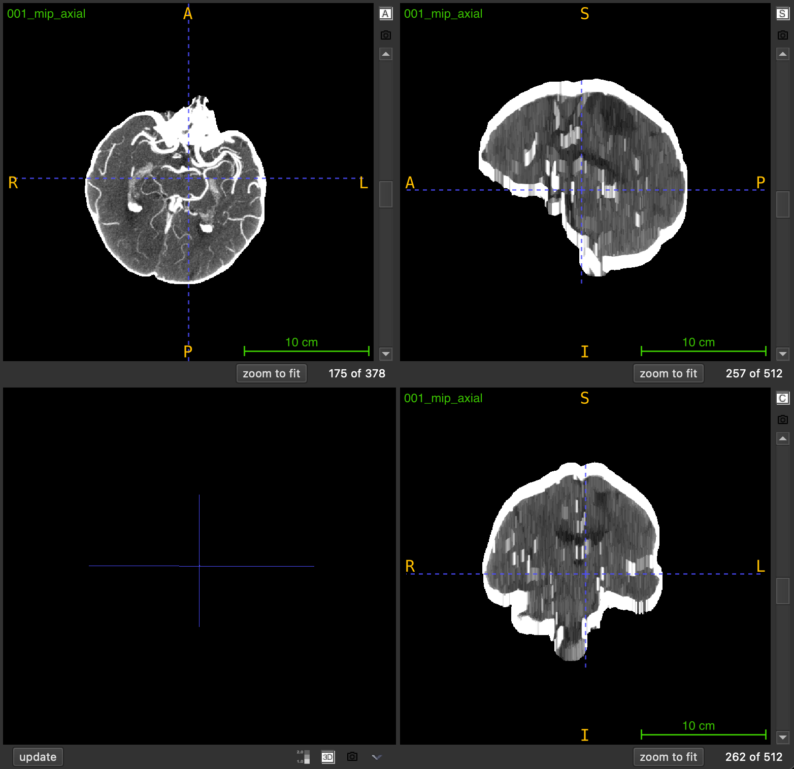

# `mip`

Generate a sliding-window Maximum Intensity Projection from a 3D medical imaging volume to enhance high-intensity structures like blood vessels.

```python
mip(
    nii_path: str,
    output_path: str,
    window_size: int = 10,
    view: str = "axial",
    debug: bool = False
) -> None
```

## Overview

Maximum Intensity Projection (MIP) is an enhancement technique that highlights high-intensity structures by replacing each voxel with the maximum intensity value found in its local neighborhood. This function applies a sliding-window approach where each output slice is created by projecting a local neighborhood of slices along a chosen anatomical axis.

**Key characteristics**:
- **Local projection**: Each slice uses a neighborhood centered at its position (not global)
- **Same dimensions**: Output volume has identical shape to input
- **Enhanced visibility**: Bright structures (vessels, contrast) become more prominent
- **Preserved spatial information**: Unlike global MIP, spatial relationships are maintained

The technique is particularly valuable for:
- Enhancing vascular structures in angiography
- Improving contrast-enhanced region visibility
- Preprocessing for vessel detection and segmentation
- Reducing noise while preserving peak intensities

<br>  <br>

## Parameters

| Name          | Type   | Default    | Description                                                                                          |
|---------------|--------|------------|------------------------------------------------------------------------------------------------------|
| `nii_path`    | `str`  | *required* | Path to the input medical volume in `.nii.gz` format.                                               |
| `output_path` | `str`  | *required* | Directory where the MIP volume will be saved. Created automatically if it doesn't exist.            |
| `window_size` | `int`  | `10`       | Number of slices on each side of current position for projection. Effective window: `2×size+1`.     |
| `view`        | `str`  | `"axial"`  | Anatomical plane for projection: `"axial"`, `"coronal"`, or `"sagittal"`.                          |
| `debug`       | `bool` | `False`    | If `True`, prints progress information and output filename.                                         |

## Returns

`None` – The function saves the MIP volume to disk.

## Output File

The MIP volume is saved as:
```
<PREFIX>_mip_<VIEW>.nii.gz
```

**Example**: Input `scan_042.nii.gz` → Output `scan_042_mip_axial.nii.gz`

### Output Volume Properties
- **Dimensions**: Same as input volume
- **Data type**: Same as input (typically float)
- **Spatial metadata**: Inherits affine transformation from input
- **Intensity range**: Equal to or higher than input (due to max operation)

## Sliding Window Mechanism

For each slice at position `i`, the function:
1. Defines a neighborhood: `[i - window_size, i + window_size]`
2. Extracts the subvolume within this range
3. Computes the maximum intensity across the neighborhood
4. Assigns the result to output slice `i`

**Effective window length**: `2 × window_size + 1`

**Example** (window_size=3):
```
Slice index: 10
Window range: [7, 13]  (7 slices total)
Output slice 10 = max(slices 7, 8, 9, 10, 11, 12, 13)
```

## Window Size Selection

The `window_size` parameter controls the neighborhood extent:

| Window Size | Effective Slices | Effect                                  | Best For                    |
|-------------|------------------|-----------------------------------------|-----------------------------|
| 3-5         | 7-11 slices      | Minimal smoothing, local enhancement    | Fine vessel details         |
| 10-15       | 21-31 slices     | Moderate enhancement, balanced          | General purpose             |
| 20-30       | 41-61 slices     | Strong enhancement, wider context       | Large vessel structures     |
| 40+         | 81+ slices       | Maximum enhancement, near-global view   | Overview visualization      |

**Trade-off considerations**:
- **Smaller windows**: Preserve fine details but provide less enhancement
- **Larger windows**: Stronger enhancement but may blur details and mix unrelated structures
- **Optimal size**: Depends on structure size and spacing between slices

## Anatomical Views

The `view` parameter determines the projection axis:

| View         | Projection Axis | Direction         | Common Applications          |
|--------------|-----------------|-------------------|------------------------------|
| `"axial"`    | Z-axis          | Top to bottom     | Brain vessels, chest imaging |
| `"coronal"`  | Y-axis          | Front to back     | Spine vessels, full body     |
| `"sagittal"` | X-axis          | Left to right     | Bilateral vessel comparison  |

## Exceptions

| Exception            | Condition                                                          |
|----------------------|--------------------------------------------------------------------|
| `FileNotFoundError`  | The input file does not exist                                     |
| `ValueError`         | File is not in `.nii.gz` format                                   |
| `ValueError`         | Input is not a 3D volume                                          |
| `ValueError`         | Invalid `view` parameter                                          |

## Usage Notes

- **Input Format**: Only `.nii.gz` files are accepted
- **3D Volumes Required**: Input must be a 3D NIfTI image
- **Edge Handling**: Windows are clipped at volume boundaries
- **Output Directory**: Automatically created if it doesn't exist
- **Spatial Metadata**: Affine transformation is preserved
- **Progress Display**: Shows progress bar during processing

## Examples

### Basic Usage
Generate MIP with default settings:

```python
from nidataset.preprocessing import mip

mip(
    nii_path="angiography/vessel_scan.nii.gz",
    output_path="enhanced/",
    window_size=10,
    view="axial"
)
# Output: enhanced/vessel_scan_mip_axial.nii.gz
```

### With Debug Information
Enable verbose output:

```python
mip(
    nii_path="ct_angio.nii.gz",
    output_path="mip_results/",
    window_size=15,
    view="coronal",
    debug=True
)
# Prints progress bar and:
# MIP saved at: mip_results/ct_angio_mip_coronal.nii.gz
```

### Strong Enhancement for Large Vessels
Use large window for prominent structures:

```python
mip(
    nii_path="aorta_scan.nii.gz",
    output_path="enhanced_vessels/",
    window_size=25,  # 51-slice window
    view="axial",
    debug=True
)
```

### Fine Detail Preservation
Use small window for detailed structures:

```python
mip(
    nii_path="cerebral_vessels.nii.gz",
    output_path="detail_preserved/",
    window_size=5,  # 11-slice window
    view="axial",
    debug=True
)
```

### Multi-View Processing
Generate MIP for all anatomical views:

```python
from nidataset.preprocessing import mip

scan_file = "vessel_scan.nii.gz"
views = ["axial", "coronal", "sagittal"]

for view in views:
    mip(
        nii_path=scan_file,
        output_path=f"mip_multiview/{view}/",
        window_size=15,
        view=view,
        debug=True
    )
# Creates: mip_multiview/axial/vessel_scan_mip_axial.nii.gz, etc.
```

### Comparing Window Sizes
Test different window sizes to find optimal enhancement:

```python
from nidataset.preprocessing import mip

scan_file = "test_scan.nii.gz"
window_sizes = [5, 10, 15, 20, 30]

for size in window_sizes:
    mip(
        nii_path=scan_file,
        output_path=f"window_test/size_{size}/",
        window_size=size,
        view="axial",
        debug=True
    )
    print(f"Window size {size}: effective window = {2*size+1} slices")

print("\nCompare outputs visually to select optimal window")
```

### Quality Assessment
Generate MIP and evaluate enhancement:

```python
import nibabel as nib
import numpy as np
from nidataset.preprocessing import mip

# Generate MIP
mip(
    nii_path="qa/original_scan.nii.gz",
    output_path="qa/mip_output/",
    window_size=15,
    view="axial",
    debug=True
)

# Load original and MIP
original = nib.load("qa/original_scan.nii.gz")
mip_vol = nib.load("qa/mip_output/original_scan_mip_axial.nii.gz")

orig_data = original.get_fdata()
mip_data = mip_vol.get_fdata()

# Analyze enhancement
print(f"\nEnhancement Analysis:")
print(f"  Original shape: {orig_data.shape}")
print(f"  MIP shape: {mip_data.shape}")
print(f"  Original intensity range: [{orig_data.min():.1f}, {orig_data.max():.1f}]")
print(f"  MIP intensity range: [{mip_data.min():.1f}, {mip_data.max():.1f}]")

# Compare mean intensities in vessel region (example coordinates)
vessel_region_orig = orig_data[100:150, 100:150, 50:100]
vessel_region_mip = mip_data[100:150, 100:150, 50:100]

print(f"  Vessel region - Original mean: {vessel_region_orig.mean():.1f}")
print(f"  Vessel region - MIP mean: {vessel_region_mip.mean():.1f}")
print(f"  Enhancement factor: {vessel_region_mip.mean() / vessel_region_orig.mean():.2f}x")
```

### Preprocessing for Vessel Segmentation
Use MIP as preprocessing step:

```python
from nidataset.preprocessing import mip
from nidataset.volume import generate_brain_mask

scan_file = "angiography.nii.gz"

# Step 1: Generate MIP to enhance vessels
mip(
    nii_path=scan_file,
    output_path="pipeline/mip/",
    window_size=15,
    view="axial",
    debug=True
)

# Step 2: Generate brain mask on enhanced volume
generate_brain_mask(
    nii_path="pipeline/mip/angiography_mip_axial.nii.gz",
    output_path="pipeline/masks/",
    threshold=(100, 500),  # Higher threshold for enhanced vessels
    closing_radius=3,
    debug=True
)

# Step 3: Apply mask to MIP volume
import nibabel as nib
mip_vol = nib.load("pipeline/mip/angiography_mip_axial.nii.gz")
mask = nib.load("pipeline/masks/angiography_mip_axial_brain_mask.nii.gz")

mip_data = mip_vol.get_fdata()
mask_data = mask.get_fdata()

vessel_focused = mip_data * mask_data

# Save vessel-focused volume
vessel_img = nib.Nifti1Image(vessel_focused, mip_vol.affine)
nib.save(vessel_img, "pipeline/vessel_segmentation_ready.nii.gz")

print("Preprocessing complete - ready for vessel segmentation")
```

### Optimal Window Size Determination
Analyze enhancement vs detail trade-off:

```python
import nibabel as nib
import numpy as np
from nidataset.preprocessing import mip
from scipy import ndimage

scan_file = "analysis/test_scan.nii.gz"
window_sizes = [5, 10, 15, 20, 25, 30]

results = []

for size in window_sizes:
    # Generate MIP
    mip(
        nii_path=scan_file,
        output_path=f"analysis/window_{size}/",
        window_size=size,
        view="axial"
    )
    
    # Load and analyze
    original = nib.load(scan_file)
    mip_vol = nib.load(f"analysis/window_{size}/test_scan_mip_axial.nii.gz")
    
    orig_data = original.get_fdata()
    mip_data = mip_vol.get_fdata()
    
    # Calculate metrics
    enhancement = mip_data.mean() / orig_data.mean()
    
    # Estimate detail preservation (via edge detection)
    edges_orig = ndimage.sobel(orig_data)
    edges_mip = ndimage.sobel(mip_data)
    edge_ratio = np.sum(edges_mip > 0) / np.sum(edges_orig > 0)
    
    results.append({
        'window_size': size,
        'effective_slices': 2*size+1,
        'enhancement': enhancement,
        'edge_preservation': edge_ratio
    })

# Display results
import pandas as pd
df = pd.DataFrame(results)
print("\nWindow Size Analysis:")
print(df.to_string(index=False))
print("\nOptimal: Balance between enhancement and edge preservation")
```

### Creating Visualization Comparison
Generate side-by-side comparison:

```python
import nibabel as nib
import numpy as np
from nidataset.preprocessing import mip

# Generate MIP
mip(
    nii_path="visualization/scan.nii.gz",
    output_path="visualization/mip/",
    window_size=15,
    view="axial",
    debug=True
)

# Load both volumes
original = nib.load("visualization/scan.nii.gz")
mip_vol = nib.load("visualization/mip/scan_mip_axial.nii.gz")

orig_data = original.get_fdata()
mip_data = mip_vol.get_fdata()

# Create side-by-side comparison (middle slice)
mid_slice = orig_data.shape[2] // 2

orig_slice = orig_data[:, :, mid_slice]
mip_slice = mip_data[:, :, mid_slice]

# Normalize for display
orig_norm = (orig_slice - orig_slice.min()) / (orig_slice.max() - orig_slice.min())
mip_norm = (mip_slice - mip_slice.min()) / (mip_slice.max() - mip_slice.min())

# Concatenate horizontally
comparison = np.hstack([orig_norm, mip_norm])

# Save as 2D image for visualization
from PIL import Image
comparison_img = Image.fromarray((comparison * 255).astype(np.uint8))
comparison_img.save("visualization/comparison.png")

print("Comparison image created: visualization/comparison.png")
```

### Integration with Deep Learning Pipeline
Prepare MIP-enhanced data for training:

```python
from nidataset.preprocessing import mip
from nidataset.slices import extract_slices

scan_files = ["train_001.nii.gz", "train_002.nii.gz", "train_003.nii.gz"]

for scan_file in scan_files:
    # Step 1: Generate MIP
    mip(
        nii_path=f"training/raw/{scan_file}",
        output_path="training/mip_volumes/",
        window_size=15,
        view="axial",
        debug=True
    )
    
    # Step 2: Extract 2D slices from MIP
    mip_filename = scan_file.replace('.nii.gz', '_mip_axial.nii.gz')
    extract_slices(
        nii_path=f"training/mip_volumes/{mip_filename}",
        output_path="training/mip_slices/",
        view="axial",
        target_size=(512, 512),
        debug=True
    )

print("MIP-enhanced training data prepared")
```

### Batch Processing with Error Handling
Process multiple files robustly:

```python
from nidataset.preprocessing import mip
import os

scan_folder = "raw_scans/"
output_folder = "mip_processed/"
failed_files = []

for filename in os.listdir(scan_folder):
    if filename.endswith('.nii.gz'):
        try:
            mip(
                nii_path=os.path.join(scan_folder, filename),
                output_path=output_folder,
                window_size=15,
                view="axial",
                debug=True
            )
            print(f"✓ Processed: {filename}")
        except Exception as e:
            print(f"✗ Failed: {filename} - {str(e)}")
            failed_files.append(filename)

if failed_files:
    print(f"\n{len(failed_files)} files failed:")
    for f in failed_files:
        print(f"  - {f}")
else:
    print("\nAll files processed successfully")
```

## Typical Workflow

```python
from nidataset.preprocessing import mip
import nibabel as nib

# 1. Define input and output
scan_file = "angiography/vessel_scan.nii.gz"
output_folder = "enhanced/"

# 2. Generate MIP with appropriate window size
mip(
    nii_path=scan_file,
    output_path=output_folder,
    window_size=15,  # Adjust based on vessel size
    view="axial",
    debug=True
)

# 3. Verify output
mip_vol = nib.load("enhanced/vessel_scan_mip_axial.nii.gz")
print(f"MIP volume shape: {mip_vol.shape}")

# 4. Use MIP volume for:
# - Vessel detection and segmentation
# - Aneurysm identification
# - Vascular analysis
# - Training data for deep learning models
```