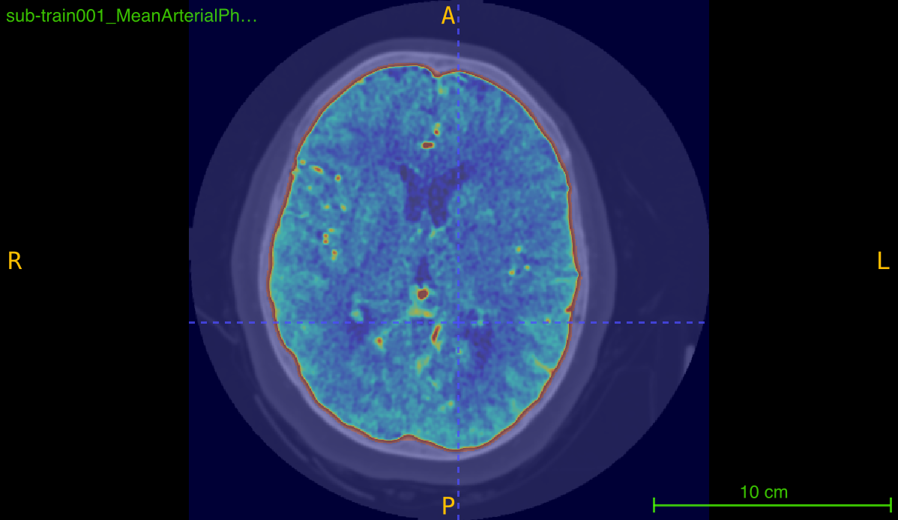
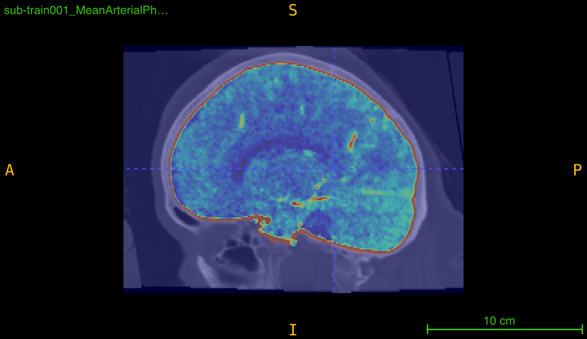
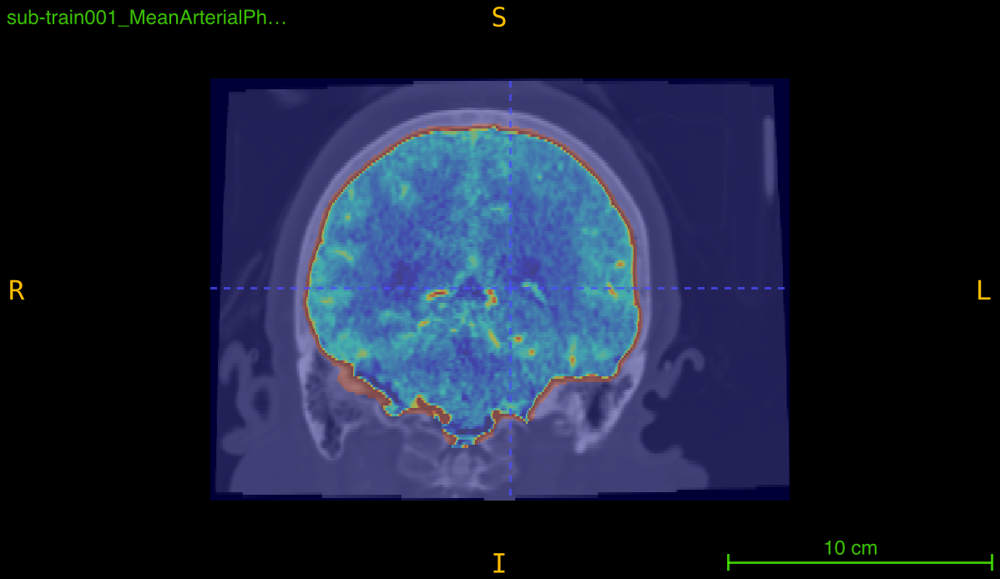

# `skull_CTA`

Apply a specialized skull-stripping pipeline to a single angiography volume using intensity preprocessing, Gaussian smoothing, and FSL BET for brain extraction.

```python
skull_CTA(
    nii_path: str,
    output_path: str,
    f_value: float = 0.1,
    clip_value: tuple = (0, 200),
    cleanup: bool = False,
    debug: bool = False
) -> None
```

## Overview

This function implements a multi-stage skull-stripping pipeline specifically designed for contrast-enhanced angiography imaging. The pipeline combines intensity preprocessing with FSL's Brain Extraction Tool (BET) to isolate brain tissue and vasculature from skull and non-brain structures.

<br><br>
<br><br>
<br><br>

**Processing pipeline**:
1. **Initial thresholding**: Clip intensities to [0, 100] range
2. **Gaussian smoothing**: Reduce noise with sigma=1
3. **Secondary thresholding**: Re-clip to [0, 100] after smoothing
4. **BET skull-stripping**: Remove skull using FSL BET
5. **Final clipping**: Normalize to desired intensity range

This is essential for:
- Isolating brain vasculature in angiography scans
- Removing skull interference in vessel detection
- Standardizing intensity ranges for analysis
- Preparing data for vessel segmentation
- Reducing false positives from bone in detection tasks

## Parameters

| Name          | Type    | Default    | Description                                                                                          |
|---------------|---------|------------|------------------------------------------------------------------------------------------------------|
| `nii_path`    | `str`   | *required* | Path to the input angiography volume in `.nii.gz` format.                                           |
| `output_path` | `str`   | *required* | Directory where all outputs will be saved. Created automatically if it doesn't exist.               |
| `f_value`     | `float` | `0.1`      | Fractional intensity threshold for BET (0-1). Lower values = more aggressive stripping.             |
| `clip_value`  | `tuple` | `(0, 200)` | Intensity range `(min, max)` for final clipping after skull removal.                                |
| `cleanup`     | `bool`  | `False`    | If `True`, deletes intermediate files. Mask and final clipped volume always retained.               |
| `debug`       | `bool`  | `False`    | If `True`, prints detailed information about output file locations.                                 |

## Returns

`None` – The function saves processed volumes and mask to disk.

## Output Files

The function generates multiple files during processing:

### Intermediate Files (removed if cleanup=True)

| File                           | Description                                       |
|--------------------------------|---------------------------------------------------|
| `<PREFIX>_th.nii.gz`           | After initial thresholding [0-100]               |
| `<PREFIX>_th_sm.nii.gz`        | After Gaussian smoothing (sigma=1)               |
| `<PREFIX>_th_sm_th.nii.gz`     | After secondary thresholding [0-100]             |
| `<PREFIX>_skulled.nii.gz`      | BET output before final clipping                 |

### Final Output Files (always retained)

| File                                  | Description                                       |
|---------------------------------------|---------------------------------------------------|
| `<PREFIX>_skulled_mask.nii.gz`        | Binary brain mask from BET                        |
| `<PREFIX>_skulled_clipped.nii.gz`     | Final skull-stripped and intensity-clipped volume |

**Example**: Input `scan_042.nii.gz` produces:
- `scan_042_skulled_mask.nii.gz`
- `scan_042_skulled_clipped.nii.gz`

## Processing Pipeline Details

### Step 1: Initial Thresholding
```bash
fslmaths input.nii.gz -thr 0 -uthr 100 output_th.nii.gz
```
Clips intensity values to [0, 100] range to remove extreme values and background.

### Step 2: Gaussian Smoothing
```bash
fslmaths input_th.nii.gz -s 1 output_th_sm.nii.gz
```
Applies Gaussian blur with sigma=1 to reduce noise while preserving structures.

### Step 3: Secondary Thresholding
```bash
fslmaths input_th_sm.nii.gz -thr 0 -uthr 100 output_th_sm_th.nii.gz
```
Re-applies [0, 100] clipping after smoothing to ensure intensity range.

### Step 4: BET Skull-Stripping
```bash
bet input_th_sm_th.nii.gz output_skulled.nii.gz -R -f 0.1 -g 0 -m
```
**Parameters**:
- `-R`: Robust brain center estimation
- `-f 0.1`: Fractional intensity threshold (default)
- `-g 0`: No vertical gradient in intensity
- `-m`: Generate binary mask

### Step 5: Final Intensity Clipping
```python
clipped = np.clip(skulled_data, min, max)
```
Normalizes intensity range to specified bounds (default [0, 200]).

## BET f_value Parameter

The `f_value` parameter controls skull removal aggressiveness:

| f_value | Effect                           | When to Use                           |
|---------|----------------------------------|---------------------------------------|
| 0.05    | Very aggressive, removes more    | Thick skull, heavy calcification      |
| 0.1     | Aggressive (default)             | Standard angiography scans            |
| 0.2     | Moderate                         | Thin skull, pediatric cases           |
| 0.3-0.5 | Conservative, preserves more     | Ensure all brain tissue retained      |

**Guidelines**:
- **Lower (0.05-0.15)**: More skull removed, risk of brain removal
- **Higher (0.2-0.5)**: Less aggressive, may leave some skull
- **Start with 0.1** and adjust based on visual inspection

## Intensity Clipping

The `clip_value` tuple defines the final intensity normalization:

| Range       | Effect                                      | Use Case                        |
|-------------|---------------------------------------------|---------------------------------|
| (0, 100)    | Conservative, soft tissue focus             | Basic tissue analysis           |
| (0, 200)    | Standard angiography range (default)        | Most vessel analysis tasks      |
| (0, 300)    | Include high-intensity contrast             | Bright vessel enhancement       |
| (0, 500)    | Very inclusive, may include artifacts       | Preserve all contrast regions   |

## FSL Requirements

**Critical**: This function requires FSL (FMRIB Software Library) installation:

### Installation
1. Download from https://fsl.fmrib.ox.ac.uk/
2. Follow platform-specific installation instructions
3. Configure environment variables (typically in `.bashrc` or `.bash_profile`)

### Verification
```bash
# Check FSL installation
which fslmaths  # Should return path to executable
which bet       # Should return path to executable

# Test BET
bet  # Should display help information
```

### Environment Setup
FSL requires proper environment configuration:
```bash
# Typical FSL setup (add to .bashrc)
FSLDIR=/usr/local/fsl
. ${FSLDIR}/etc/fslconf/fsl.sh
PATH=${FSLDIR}/bin:${PATH}
export FSLDIR PATH
```

### Execution Requirements
- **Run from terminal**: Execute Python scripts from command line, not IDE
- **Environment variables**: FSL paths must be in shell environment
- **Command**: `python3 script.py` (not from IDE's run button)

## Exceptions

| Exception            | Condition                                                          |
|----------------------|--------------------------------------------------------------------|
| `FileNotFoundError`  | The input file does not exist                                     |
| `ValueError`         | File is not in `.nii.gz` format                                   |
| `ValueError`         | Input data is not 3D                                              |
| `RuntimeError`       | FSL command execution failed                                      |

## Usage Notes

- **Input Format**: Only `.nii.gz` files are accepted
- **3D Volumes Required**: Input must be a 3D NIfTI image
- **Pre-centered Volumes**: Input should be centered on brain region
- **No FOV Cropping**: Original dimensions are preserved
- **FSL Dependency**: FSL must be installed and properly configured
- **Output Directory**: Automatically created if it doesn't exist
- **Intermediate Files**: Can be removed with `cleanup=True` to save space

## Examples

### Basic Usage
Process a single angiography volume:

```python
from nidataset.preprocessing import skull_CTA

skull_CTA(
    nii_path="angiography/patient_001.nii.gz",
    output_path="processed/patient_001/",
    f_value=0.1,
    clip_value=(0, 200)
)
# Output: processed/patient_001/patient_001_skulled_clipped.nii.gz
#         processed/patient_001/patient_001_skulled_mask.nii.gz
```

### With Cleanup
Remove intermediate files to save disk space:

```python
skull_CTA(
    nii_path="data/scan.nii.gz",
    output_path="data/processed/",
    f_value=0.1,
    clip_value=(0, 200),
    cleanup=True,  # Remove intermediate files
    debug=True
)
# Prints: Skull-stripped image saved at: 'data/processed/scan_skulled_clipped.nii.gz'
#         Skull mask saved at: 'data/processed/scan_skulled_mask.nii.gz'
```

### Aggressive Skull Removal
Use lower f_value for thick skull:

```python
skull_CTA(
    nii_path="thick_skull/scan.nii.gz",
    output_path="aggressive_strip/",
    f_value=0.05,  # More aggressive
    clip_value=(0, 200),
    cleanup=True,
    debug=True
)
```

### Conservative Stripping
Use higher f_value to preserve brain tissue:

```python
skull_CTA(
    nii_path="pediatric/child_scan.nii.gz",
    output_path="conservative_strip/",
    f_value=0.3,  # Less aggressive
    clip_value=(0, 200),
    cleanup=True,
    debug=True
)
```

### Custom Intensity Range
Adjust clipping for high-contrast scans:

```python
skull_CTA(
    nii_path="high_contrast.nii.gz",
    output_path="processed/",
    f_value=0.1,
    clip_value=(0, 300),  # Higher upper bound
    cleanup=True,
    debug=True
)
```

### Quality Control Inspection
Keep intermediates for verification:

```python
skull_CTA(
    nii_path="qa/test_scan.nii.gz",
    output_path="qa/processing_steps/",
    f_value=0.1,
    clip_value=(0, 200),
    cleanup=False,  # Keep all intermediate files
    debug=True
)

# Now you can inspect:
# - test_scan_th.nii.gz (after initial threshold)
# - test_scan_th_sm.nii.gz (after smoothing)
# - test_scan_th_sm_th.nii.gz (after second threshold)
# - test_scan_skulled.nii.gz (BET output)
# - test_scan_skulled_clipped.nii.gz (final result)
```

### Verifying FSL Installation
Check FSL before processing:

```python
import subprocess

def check_fsl():
    """Verify FSL is properly installed."""
    try:
        # Check fslmaths
        subprocess.run(['fslmaths'], capture_output=True, check=False)
        print("✓ fslmaths found")
        
        # Check bet
        subprocess.run(['bet'], capture_output=True, check=False)
        print("✓ bet found")
        
        return True
    except FileNotFoundError as e:
        print(f"✗ FSL not found: {e}")
        print("Please install FSL and configure environment variables")
        return False

# Verify before processing
if check_fsl():
    from nidataset.preprocessing import skull_CTA
    
    skull_CTA(
        nii_path="scan.nii.gz",
        output_path="processed/",
        f_value=0.1,
        clip_value=(0, 200),
        cleanup=True,
        debug=True
    )
```

### Testing Different f_values
Find optimal skull-stripping threshold:

```python
from nidataset.preprocessing import skull_CTA
import nibabel as nib
import numpy as np

test_f_values = [0.05, 0.1, 0.15, 0.2, 0.3]
test_scan = "test_data/sample.nii.gz"

results = []

for f_val in test_f_values:
    output_dir = f"f_value_test/f_{f_val}/"
    
    skull_CTA(
        nii_path=test_scan,
        output_path=output_dir,
        f_value=f_val,
        clip_value=(0, 200),
        cleanup=True,
        debug=True
    )
    
    # Analyze brain coverage
    mask = nib.load(f"{output_dir}/sample_skulled_mask.nii.gz")
    mask_data = mask.get_fdata()
    
    coverage = np.sum(mask_data > 0) / np.prod(mask_data.shape) * 100
    
    results.append({
        'f_value': f_val,
        'brain_coverage': coverage
    })
    
    print(f"f_value={f_val}: coverage={coverage:.1f}%")

print("\nCompare outputs visually to select optimal f_value")
```

### Assessing Skull Removal Quality
Evaluate processing results:

```python
import nibabel as nib
import numpy as np
from nidataset.preprocessing import skull_CTA

# Process
skull_CTA(
    nii_path="qa/original.nii.gz",
    output_path="qa/processed/",
    f_value=0.1,
    clip_value=(0, 200),
    cleanup=False,  # Keep intermediates for analysis
    debug=True
)

# Load results
original = nib.load("qa/original.nii.gz")
mask = nib.load("qa/processed/original_skulled_mask.nii.gz")
stripped = nib.load("qa/processed/original_skulled_clipped.nii.gz")

orig_data = original.get_fdata()
mask_data = mask.get_fdata()
stripped_data = stripped.get_fdata()

print("\nQuality Assessment:")

# 1. Brain coverage
brain_voxels = np.sum(mask_data > 0)
total_voxels = np.prod(mask_data.shape)
coverage = (brain_voxels / total_voxels) * 100

print(f"  Brain coverage: {coverage:.1f}%")
print(f"  Expected range: 20-40% for head scans")

if coverage < 15:
    print(f"  ⚠️ Warning: Low coverage, try higher f_value")
elif coverage > 50:
    print(f"  ⚠️ Warning: High coverage, try lower f_value")
else:
    print(f"  ✓ Coverage looks reasonable")

# 2. Intensity ranges
print(f"\n  Original intensity: [{orig_data.min():.1f}, {orig_data.max():.1f}]")
print(f"  Stripped intensity: [{stripped_data.min():.1f}, {stripped_data.max():.1f}]")
print(f"  Target clipping: [0, 200]")

# 3. Check masking
brain_region = stripped_data[mask_data > 0]
print(f"\n  Brain region mean: {brain_region.mean():.1f}")
print(f"  Brain region std: {brain_region.std():.1f}")
```

### Creating Visualization Overlay
Generate overlay for visual inspection:

```python
import nibabel as nib
import numpy as np
from nidataset.preprocessing import skull_CTA

# Process
skull_CTA(
    nii_path="visualization/scan.nii.gz",
    output_path="visualization/processed/",
    f_value=0.1,
    clip_value=(0, 200),
    cleanup=False,
    debug=True
)

# Load original and mask
original = nib.load("visualization/scan.nii.gz")
mask = nib.load("visualization/processed/scan_skulled_mask.nii.gz")

orig_data = original.get_fdata()
mask_data = mask.get_fdata()

# Create edge overlay
from scipy import ndimage
edges = ndimage.sobel(mask_data)

overlay = orig_data.copy()
overlay[edges > 0] = orig_data.max()  # Highlight mask boundary

# Save overlay
overlay_img = nib.Nifti1Image(overlay, original.affine)
nib.save(overlay_img, "visualization/mask_overlay.nii.gz")
print("Mask overlay created for quality control")
```

### Error Handling
Robust processing with error management:

```python
from nidataset.preprocessing import skull_CTA

def process_with_error_handling(input_path, output_path):
    """Process scan with comprehensive error handling."""
    
    try:
        skull_CTA(
            nii_path=input_path,
            output_path=output_path,
            f_value=0.1,
            clip_value=(0, 200),
            cleanup=True,
            debug=True
        )
        print(f"✓ Successfully processed: {input_path}")
        return True
        
    except FileNotFoundError as e:
        print(f"✗ File not found: {e}")
        return False
        
    except RuntimeError as e:
        print(f"✗ FSL execution failed: {e}")
        print("Check FSL installation and environment variables")
        return False
        
    except Exception as e:
        print(f"✗ Unexpected error: {e}")
        return False

# Use in processing
process_with_error_handling(
    "data/scan.nii.gz",
    "data/processed/"
)
```

### Integration with Vessel Analysis
Complete preprocessing pipeline:

```python
from nidataset.preprocessing import skull_CTA, mip

# Step 1: Skull stripping
print("Step 1: Removing skull...")
skull_CTA(
    nii_path="pipeline/original.nii.gz",
    output_path="pipeline/skull_stripped/",
    f_value=0.1,
    clip_value=(0, 200),
    cleanup=True,
    debug=True
)

# Step 2: Enhance vessels with MIP
print("\nStep 2: Enhancing vessels...")
mip(
    nii_path="pipeline/skull_stripped/original_skulled_clipped.nii.gz",
    output_path="pipeline/vessel_enhanced/",
    window_size=15,
    view="axial",
    debug=True
)

print("\nPipeline complete: Ready for vessel segmentation")
```

### Batch Processing Helper
Process multiple scans:

```python
from nidataset.preprocessing import skull_CTA
import os

def batch_skull_strip(input_folder, output_base, f_value=0.1):
    """Process all scans in a folder."""
    
    success_count = 0
    fail_count = 0
    
    for filename in os.listdir(input_folder):
        if filename.endswith('.nii.gz'):
            input_path = os.path.join(input_folder, filename)
            scan_name = filename.replace('.nii.gz', '')
            output_path = os.path.join(output_base, scan_name)
            
            print(f"\nProcessing: {scan_name}")
            
            try:
                skull_CTA(
                    nii_path=input_path,
                    output_path=output_path,
                    f_value=f_value,
                    clip_value=(0, 200),
                    cleanup=True,
                    debug=False
                )
                success_count += 1
                print(f"✓ Success")
                
            except Exception as e:
                fail_count += 1
                print(f"✗ Failed: {e}")
    
    print(f"\n{'='*50}")
    print(f"Batch complete: {success_count} success, {fail_count} failed")
    
# Use
batch_skull_strip("raw_scans/", "processed_scans/", f_value=0.1)
```

## Typical Workflow

```python
from nidataset.preprocessing import skull_CTA
import subprocess
import nibabel as nib
import numpy as np

# 1. Verify FSL installation
try:
    subprocess.run(['bet', '--version'], capture_output=True, check=True)
    print("✓ FSL is properly configured")
except:
    print("✗ Error: FSL not found")
    print("Install FSL from https://fsl.fmrib.ox.ac.uk/")
    exit(1)

# 2. Process angiography scan
skull_CTA(
    nii_path="data/angiography.nii.gz",
    output_path="data/skull_stripped/",
    f_value=0.1,  # Adjust based on scan
    clip_value=(0, 200),
    cleanup=True,
    debug=True
)

# 3. Verify results
mask = nib.load("data/skull_stripped/angiography_skulled_mask.nii.gz")
stripped = nib.load("data/skull_stripped/angiography_skulled_clipped.nii.gz")

mask_data = mask.get_fdata()
coverage = np.sum(mask_data > 0) / np.prod(mask_data.shape) * 100

print(f"\nQuality Check:")
print(f"  Brain coverage: {coverage:.1f}%")
print(f"  Output shape: {stripped.shape}")

# 4. Use skull-stripped volume for:
# - Vessel segmentation
# - Aneurysm detection
# - Vascular analysis
# - Registration
```