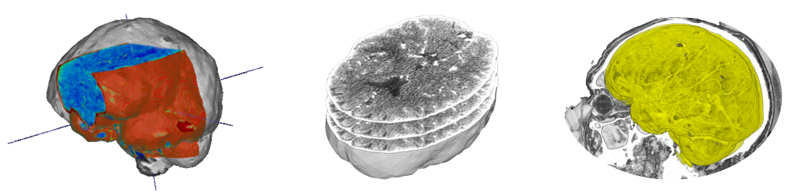

  <!-- headline -->
  
<h1> NIfTI Dataset Management</h1>

  <!-- PyPI badges -->
  
  
  
  

 

This package provides a set of utilities for handling NIfTI datasets, including slice extraction, volume manipulation, and various utility functions to facilitate the processing of medical imaging data.  

Official GitHub repository available [here](https://github.com/GiulioRusso/Ni-Dataset).  

Check [here](https://github.com/GiulioRusso/Python-tutorials/blob/main/NIfTI-Guide.md) for a complete NIfTI guide  

## 👨‍💻 Authors
- [Giulio Russo](https://www.linkedin.com/in/russogiulio/)
- [Ciro Russo, PhD](https://www.linkedin.com/in/ciro-russo-b14056100/)

## ⚖️ License

MIT License

